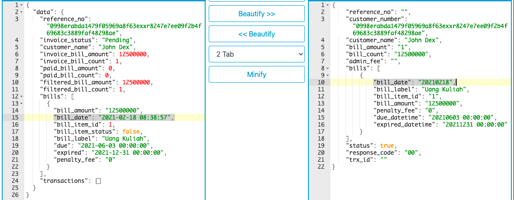
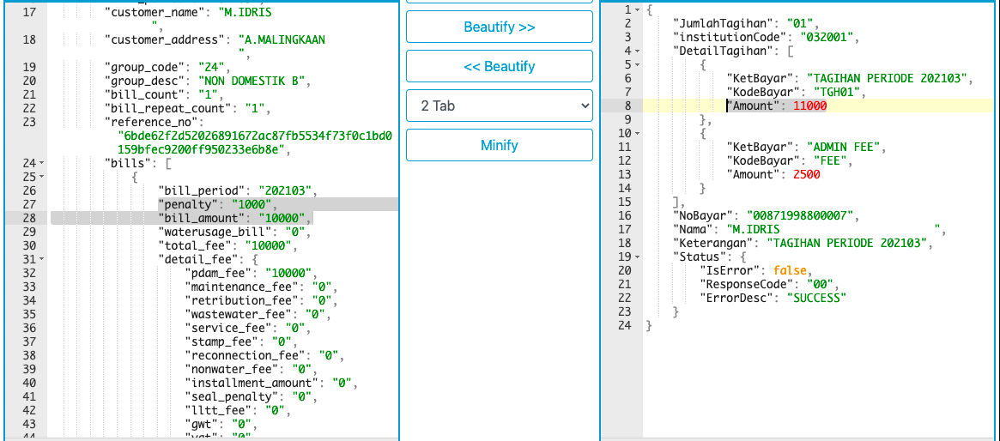
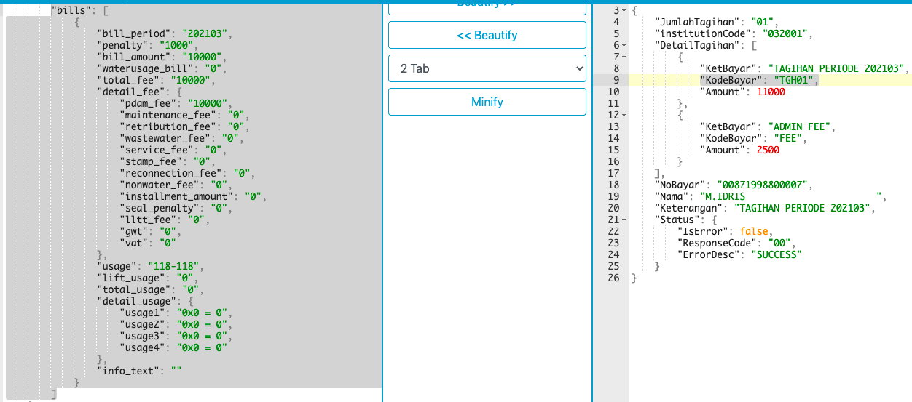

= Implementasi Function Array di BM dan PM

Materi ini menjelaskan tentang _function_ yang tersedia di BM dan PM yang digunakan saat mengolah data _array_. Sama seperti penjelasan sebelumnya, ada perbedaan pengambilan _source_ data, meliputi.

* BM: Data _array_ (Biller) diolah ke format data (Kraken)
* PM: Data _array_ (Kraken) diolah ke format data (Partner)

Adapun penggunaan rumus untuk implementasi _function array_ pada _config_ BM dan PM sama (perbedaannya terdapat pada _source_ data).

----
Case BM (date-format)
Function : array-map
Value	   : [array_format_biller|date_format, new_date_format, old_date_format, _VALUE_]

Case PM (formula)
Function : array-map-1
Value	   : [array_format_kraken_1]+[array_format_kraken_2]
Function : array-map-2
Value	   : [array_format_kraken (array-map-1)|formula, _VALUE_]

Case PM (str-pad)
Function : array-map
Value	   : [array_format_kraken|str_pad,_VALUE_,padLen,padChar,padType]
----

Adapun case BM diimplementasikan pada _config_ BM (mikroskil_edukasi_BM) dengan _function_ ‘date-format’, dengan hasil sebagai berikut.

Adapun case PM diimplementasikan pada _config_ PM (Bank Jatim Sync - Product PDAM) dengan _function_ ‘formula’ dan ‘str-pad’, dengan hasil sebagai berikut.

*_Function_ ‘formula’*

*_Function_ ‘str-pad’*

**_IMPORTANT_!**: Tonton https://drive.google.com/file/d/14LrNLU-OfimIgKWOtVUUR4yWdyR-yAw-/view[**video tutorial**] ini ya.

== *Topik terkait*

- Sebelumnya: link:../Implementasi-Get-Single-Data-Array-di-BM-dan-PM.adoc[Implementasi Get Single Data Array di BM dan PM]
- Selanjutnya: link:../Implementasi-Transformasi-Format-Array-ke-String.adoc[Implementasi Transformasi Format Array ke String]
