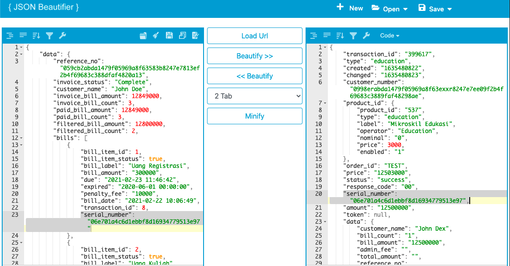

= Implementasi Get Single Data Array di BM dan PM

Materi ini akan menjelaskan tentang pengambilan satu (1)  data pada _looping_ data _array_. Sama seperti penjelasan sebelumnya, pada _case_ di BM dan PM ada perbedaan pengambilan _source_ data, meliputi.

* BM: _Get single_ data _array_ (Biller) untuk di-_set_ pada format data (Kraken)
* PM: _Get single_ data _array_ (Kraken) untuk di-_set_ pada format data (Partner)

Adapun implementasi rumus guna mendapatkan _get single_ data _array_ pada _config_ BM dan PM sama (perbedaan terdapat pada _source_ datanya) seperti di bawah ini.

----
Case BM
Function : text
Value	   : [array_format_biller.x.array_format_biller]

Case PM
Function : text
Value	   : [array_format_kraken.x.array_format_partner]

Catatan
- array merupakan 1 kesatuan mapping data
- x merupakan remark untuk ambil urutan data array
----

Adapun case BM diimplementasikan pada _config_ BM (mikroskil_edukasi_BM) dengan hasil sebagai berikut.

Adapun case BM diimplementasikan pada _config_ PM (NOBU Async - Product Telkom) dengan hasil sebagai berikut.

**_IMPORTANT_!**: Tonton https://drive.google.com/file/d/1rXWz_6Vbb4Rpoo2NcufmQL2X8Da-XR5R/view[**video tutorial**] ini ya.

== *Topik terkait*

- Sebelumnya: link:../Implementasi-Restruktur-Format-Array-di-BM-dan-PM.adoc[Implementasi Restruktur Format Array di BM dan PM]
- Selanjutnya: link:../Implementasi-Function-Array-di-BM-dan-PM.adoc[Implementasi Function Array di BM dan PM]
