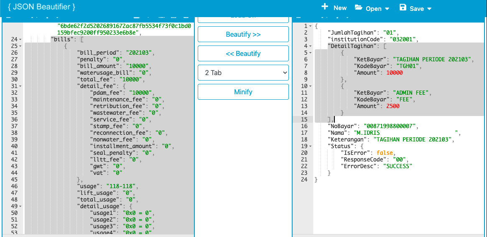

= Implementasi Restruktur Format Array di BM dan PM

Materi ini terkait dengan proses restruktur format data _array_ dari format A ke format B. Adapun _case_ yang digunakan untuk BM dan PM berbeda seperti di bawah ini.

* BM : Format _array_ A (Biller) ke format B (Kraken)
* PM : Format _array_ A (Kraken) ke format B (Partner)

Adapun implementasi rumus guna melakukan restruktur format _array_ pada _config_ BM dan PM sama (perbedaan terdapat pada _source_ datanya), seperti di bawah ini.

----
Case BM
Function : array-map
Value	   : [array_format_biller], [new_array_format_kraken]

Case PM
Function : array-map
Value	   : [array_format_kraken], [new_array_format_partner]
----

Adapun _case_ BM diimplementasikan pada _config_ BM (mikroskil_edukasi_BM) dengan hasil format _array_ sebagai berikut.

Adapun _case_ PM diimplementasikan pada _config_ PM (Bank Jatim Sync - Product PDAM) dengan hasil format _array_ seperti berikut.

**_IMPORTANT_!**: Tonton https://drive.google.com/file/d/1Ib7ennN3PfuilX99gz4wBipmOmkAbq0A/view[**video tutorial**] ini ya.

== *Topik terkait*

- Sebelumnya: link:../Pengenalan-terkait-Data-Array.adoc[Pengenalan terkait Data Array]
- Selanjutnya: link:../Implementasi-Get-Single-Data-Array-di-BM-dan-PM.adoc[Implementasi Get Single Data Array di BM dan PM]
