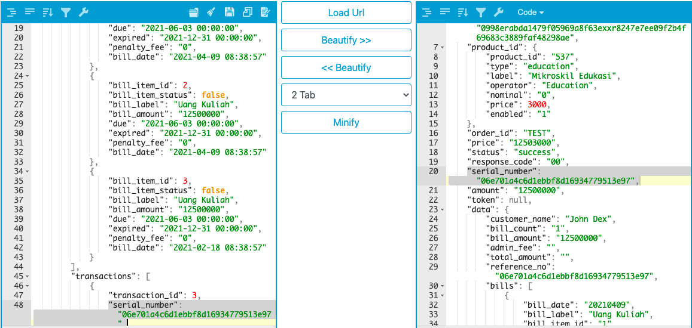

= Implementasi Transformasi Format Array ke String

Materi ini menjelaskan tentang proses perubahan format data _array_ menjadi data _string_. Harus diingat, _case_ di BM → data _array_ (Biller) diubah ke format data _string_ (Kraken).
	
Adapun penggunaan rumus untuk implementasi transformasi format _array_ ke _string_ pada config BM dapat dilihat di bawah ini.

----
Rumus 1
Function : array-map
Value	   : [array_format_biller], [new_array_format_kraken]

Rumus 2
Function : array-join
Value	   : [new_array_format_kraken]
----

Adapun case BM diimplementasikan pada _config_ BM (mikroskil_edukasi_BM) dengan hasil transformasi sebagai berikut.

**_IMPORTANT_!**: Tonton https://drive.google.com/file/d/1K-uy2a4HQ4N5u3LvmMLejaqdYsIv9Gka/view[**video tutorial**] ini ya.

== *Topik terkait*

link:../Implementasi-Function-Array-di-BM-dan-PM.adoc[Implementasi Function Array di BM dan PM]
