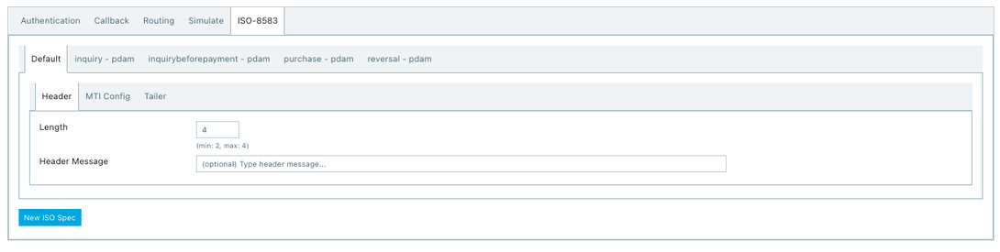
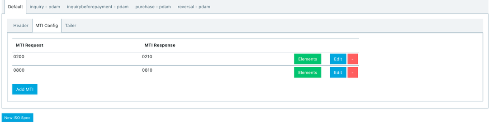
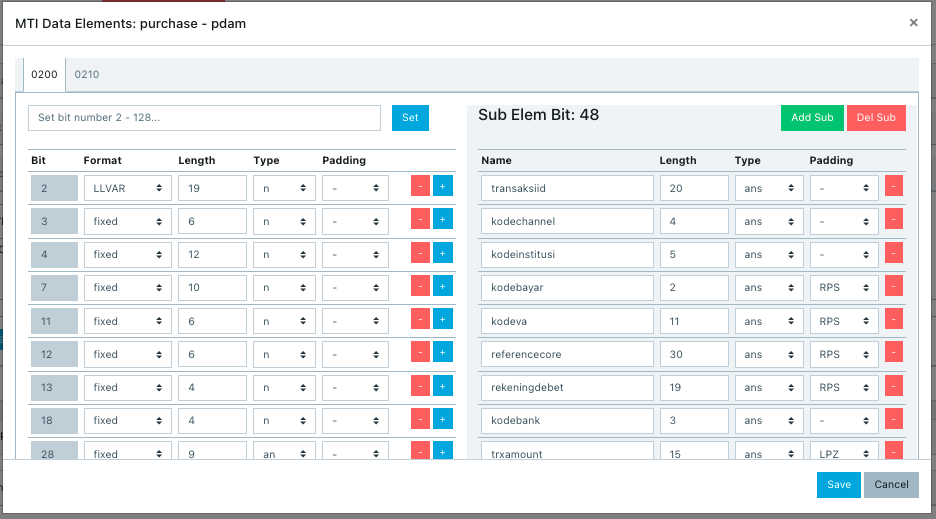

= Cara Melakukan Config API ISO dan Sub Element

Sebelum mulai melakukan konfigurasi API, pastikan kamu sudah mendapatkan dokumen dari Partner dan sudah mempelajarinya. Hal ini dilakukan agar bisa di-_parsing_ pada konfigurasi Alterra.

**_IMPORTANT_!**: Tonton https://drive.google.com/file/d/1QfsY44Jr9oUc25hPIerV4k4HCc3sdVA-/view[**video tutorial**] ini ya.

API _config_ berfungsi untuk memasukkan data Partner ke sistem Alterra. Termasuk mengisi data _mandatory_ seperti 

- _Length Header_
+

+
- _MTI Request & Response_
+

+
- _Data Element & Sub Element_
+ 
Sebelum melakukan API config sub element, pastikan data sub-nya sudah di-parsing, seperti gambar di bawah ini. 
+

**_IMPORTANT_!**: Tonton https://drive.google.com/file/d/1Urnkr_av_id5LDw8RLOUMeE69_5hNi2q/view[video tutorial] ini ya.!

== Topik terkait

- Sebelumnya: link:../melakukan-setup-koneksi.adoc[Cara melakukan _setup_ koneksi]
- Selanjutnya: link:../menambahkan-command-config-request-mapping.adoc[Cara menambahkan _command_ dan _product type configuration_]
