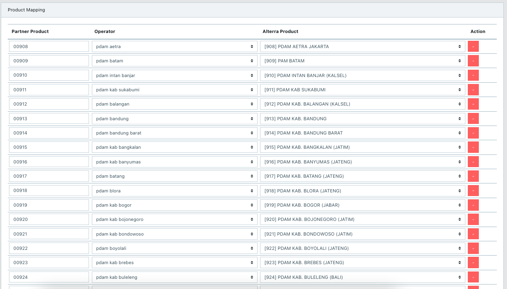
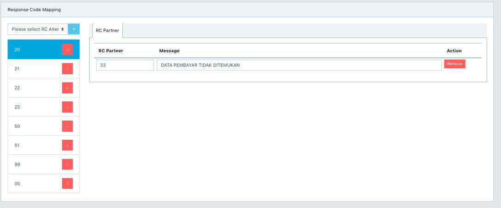

= Cara Melakukan Mapping Config Response, Product, dan Response Code

== *Cara Mapping Product ID*

Saat ini di Translator PM sudah ada fitur untuk _mapping code product_,  jadi kamu hanya perlu memasukkan _product_ ID Partner yang akan terbaca di sistem Alterra. Lihat contoh di bawah ini untuk  _product mapping_ yang ada di Translator PM.

**_IMPORTANT_!**: Tonton https://drive.google.com/file/d/19Ea2HX5HpVsLeSlI4Hf95Ew1mi_JJSDC/view[**video tutorial**] ini ya.

== *Cara Mapping Response Code*

Perlakuan khusus untuk Partner yang tidak bisa melakukan _mapping response code_ (RC) Alterra ke Partner. Saat ini di Translator PM, kamu bisa melakukannya sehingga RC yang diterima Partner sesuai dengan milik mereka. Lihat contoh di bawah ini.

== Topik terkait

- link:../menambahkan-command-config-request-mapping.adoc[Cara Menambahkan _Command_ dan _Product Type Configuration_]
