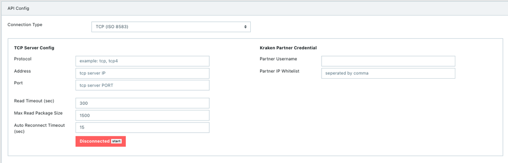

= Cara Melakukan Setup Koneksi

Partner terkoneksi dengan Alterra menggunakan 2 (dua) metode, yaitu IP Whitelist dan VPN IPSec atau Leased Line. Adapun tipe koneksi yang biasa digunakan adalah http/https. Khusus untuk ISO tipe koneksi yang digunakan adalah TCP (Transmission Control Protocol). 

Tes koneksi dapat dilakukan dengan 3 (tiga) cara berikut.

- _Open/close_ koneksi
- _Sign on test_
- _Echo test_

Tes koneksi di atas membutuhkan data IP dan Port dari Partner yang akan dihubungkan ke Alterra. Pada _case_ kali ini, kita akan membahas koneksi yang menggunakan VPN IPSec.

**_IMPORTANT_!**: Tonton https://drive.google.com/file/d/13KfZs-5xwjY6CyJCUR37D3m94TsCHMts/view[**video tutorial**] ini ya.

Ikuti langkah-langkah di bawah ini untuk melakukan _setup_ koneksi.

1. Konfirmasi ke Partner untuk mendapatkan informasi kepemilikian _form_ IPSec yang bisa kamu isi
2. Jika Partner memiliki _form_-nya, teruskan _form_ tersebut ke tim Infrastructure untuk dilengkapi dengan data dari pihak Alterra
3. Jika dari Partner tidak memiliki _form_-nya, minta _form_ ke tim Infrastructure yang sebelumnya dilengkapi dulu datanya dari pihak Alterra (BD/ITS). Kemudian, teruskan kepada Partner agar dilengkapi
4. Data yang sudah terkumpul di _form_ tersebut akan di-_setting_ terlebih dahulu oleh tim Infrastructure 
5. Masukkan IP dan Port Partner pada Translator PM, seperti pada gambar di bawah ini

== Topik terkait

link:../melakukan-api-config-iso-sub-element.adoc[Bagaimana cara melakukan "API _Config_" ISO?]