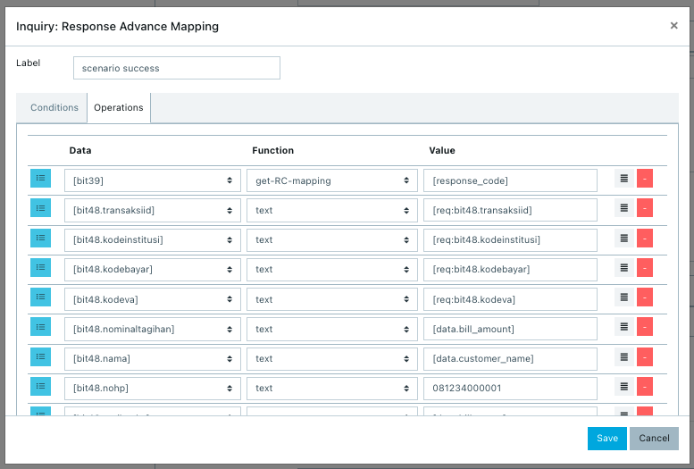

= Cara Menambahkan Command dan Product Type Configuration

Penambahan command dan _product type configuration_ ini dilakukan untuk _mapping_ data yang dikirim agar terbaca dengan benar. Pastikan sebelum memulai _mapping_, kamu sudah mendapatkan data dari Partner terkait ekspektasi masing-masing parameter. 

Akan lebih baik lagi jika bisa mendapatkan contoh _log request_ dan _response_ dari Partner, seperti contoh di bawah ini.

----
<isomsg>
  <field id="0" value="0200"/>
  <field id="2" value="0000000000"/>
  <field id="3" value="020000"/>
  <field id="4" value="000000000000"/>
  <field id="7" value="1005112829"/>
  <field id="11" value="516803"/>
  <field id="12" value="051128"/>
  <field id="13" value="1005"/>
  <field id="18" value="6010"/>
  <field id="28" value=""/>
  <field id="32" value="200"/>
  <field id="37" value="005112447269"/>
  <field id="48" value="20201005112447269   01110012161701066 000000000000000                                                                        000                                                                                                                                                      "/>
  <field id="49" value=""/>
  <field id="63" value=""/>
</isomsg>
----

----
<isomsg>
  <field id="0" value="0210"/>
  <field id="2" value="0000000000"/>
  <field id="3" value="020000"/>
  <field id="4" value="000000000000"/>
  <field id="7" value="1005112447"/>
  <field id="11" value="516803"/>
  <field id="12" value="051128"/>
  <field id="13" value="1005"/>
  <field id="18" value="6010"/>
  <field id="28" value="000000000"/>
  <field id="32" value="200"/>
  <field id="37" value="005112447269"/>
  <field id="39" value="00"/>
  <field id="48" value="20201005112447269   01110012161701066 000000000300000Janeeta Khansa Rahima                                       000000000000001012161701066                  012161701066                  SDIT AL MUCHTAR               SD5C IBNU TAIMIYAH            2020/2021                     4                             "/>
  <field id="49" value="   "/>
  <field id="63" value="INQUIRY BERHASIL"/>
</isomsg>
----

_**IMPORTANT_!**: Tonton https://drive.google.com/file/d/1Teou5CbMiY8QpZAn_OBVUNHzKMF8LRL4/view[**video tutorial**] ini ya.

- *URL dan _Body Request_*
1. Masukkan URL Alterra (_staging_ = horven, _production_ = kraken-api)
2. Selanjutnya sesuaikan pengisian _field_ dengan PM Config (berisi URL sesuai dokumen API Alterra (Swagger))
3. Sesuaikan dengan skema transaksi yang digunakan (_sync_ atau _async_)
4. _Body request_ diisi sama seperti PM Config yang lain
5. Buat _mapping_ parameter yang diterima Kraken, diambil dari parameter yang sudah di-_set request mapping_ seperti contoh di bawah ini.
+ 

- *_Request Mapping_*
+
_Request Mapping_ digunakan untuk melakukan _mapping_ data yang dimasukkan oleh Partner dan terkirim ke Alterra sebagai parameter apa. Perbedaannya dengan yang menggunakan json/xml adalah parameternya sudah jelas, tidak seperti ISO yang membutuhkan _parsing_ terlebih dahulu. Berikut adalah contoh dari _request mapping_.
+

- *_Response Mapping_*
+
_Response Mapping_ digunakan untuk memetakan data yang dikirim oleh Alterra, akan terbaca sebagai data apa pada sistem Partner. Perbedaannya dengan yang menggunakan json/xml adalah parameternya sudah jelas, tidak seperti ISO yang membutuhkan _parsing_ terlebih dahulu. Berikut adalah contoh dari _response mapping_.
+

+

== Topik terkait

- Sebelumnya: link:../melakukan-api-config-iso-sub-element.adoc[Cara melakukan _Config_ API ISO dan _Sub Element_]
- Selanjutnya: link:../melakukan-config-product-response-code-mapping.adoc[Cara _mapping response code_]

