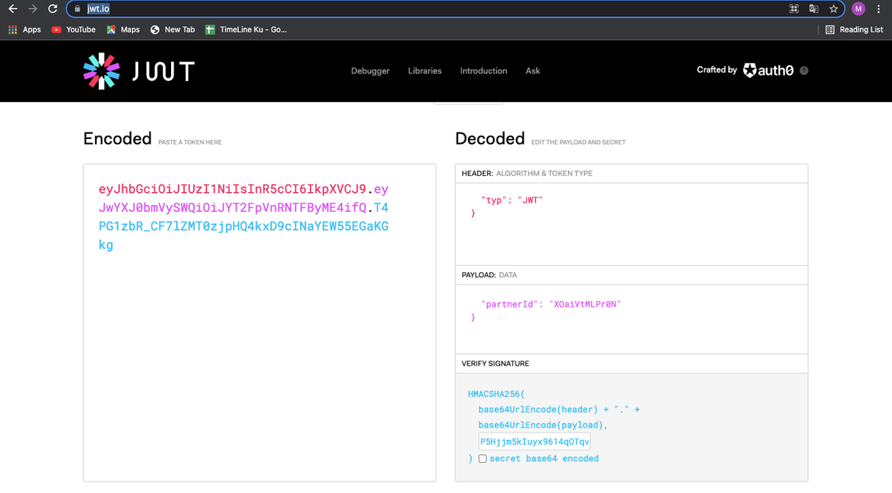

= Cara Generate Token Menggunakan Tools JWT

Pembelajaran kali ini akan menggunakan _case_ Biller Ayopop yang menggunakan token untuk setiap _service_-nya. Misalnya, ada 3 _service_ meliputi _Inquiry_, _Payment_, dan _Advice_. 

Setiap _request_ masing-masing _service_ membutuhkan _generate_ token terlebih dahulu. Jika tidak melakukan _generate_ token, maka _response_ langsung gagal ke Biller. Berikut adalah cara melakukan _generate_ token menggunakan JWT.

1. Sebelum melakukan konfigurasi di translator BM, harus melakukan _generate_ token terlebih dahulu. 
2. Aplikasi yang digunakan untuk _hit_ dan _generate_ token adalah https://jwt.io/[JWT.IO]

Ikuti langkah-langkah di bawah ini untuk menggunakan tools JWT pada proses _generate_ token.

1. Masukkan data _verify signature_ dengan _secret_ yang di-_share_ oleh Biller di email
2. Masukkan _payload request_ sesuai dengan format dari Biller
3. Setelah itu salin hasil _encode_ yang ter-_generate_ oleh sistem

**_IMPORTANT_!**: Tonton https://drive.google.com/file/d/129igO-T9TEejeDXZbXrr0F-ACEVZiNgG/view[**video tutorial**] ini ya.

== Topik terkait

link:../Cara-Hit-API-Balance-Direct-ke-Biller-Menggunakan-Postman.adoc[Cara _hit_ API _Balance Direct_ ke Biller menggunakan Postman]
