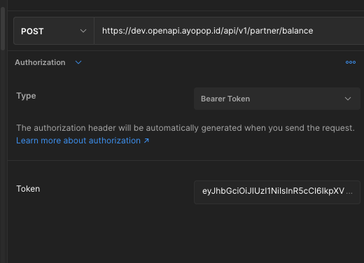
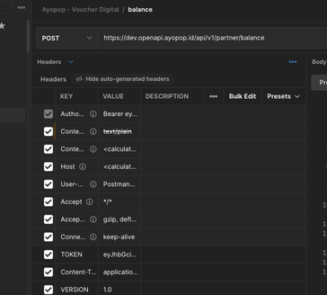

= Cara Hit API Balance Direct ke Biller Menggunakan Postman

Setelah selesai melakukan _generate signature_ di _tool_ aplikasi online, langkah selanjutnya adalah _hit direct_ ke API Biller. Kali ini _tools_ yang digunakan adalah Postman.

== *Hit Direct ke API Biller*

Ikuti langkah-langkah di bawah ini untuk melakukan _hit_ API _Balance Direct_ ke Biller. 

1. Masukkan URL stok di Postman
2. Salin hasil _generate_ token ke Postman dengan memilih tipe _bearer_ token
3. _Setting_ headers di Postman

___
* Token → hasil salinan _generate_ dari _tool_ aplikasi online
* _Content type_ →  application/json
* _Version_ → 1.0

Detailnya dapat merujuk pada gambar di bawah ini.

[cols="50%,50%",frame=none, grid=none]
|===
|
|
|===

== *Request di Postman*

* Melakukan _request_ di Postman seperti contoh di bawah ini
----
{
 "partnerId": "XOaiVtMLPr0N"
}
----
* _Request_ di Postman digunakan untuk mengirimkan _request_ kepada Biller secara langsung
* _Response_ seperti contoh di bawah ini
----
{
  "responseCode": 0,
  "success": true,
  "message": {
      "ID": "sukses",
      "EN": "success"
  },
  "data": {
      "balance": 37010271,
      "currency": "IDR",
      "partnerId": "XOaiVtMLPr0N"
  }
}
----
* Setelah mengikuti langkah-langkah di atas, selanjutnya kita bisa mulai melakukan konfigurasi di sisi translator BM untuk _service_ stok.

**_IMPORTANT_!**: Tonton https://drive.google.com/file/d/1egUKzCLeokxcrYm9VGoSsCzGxfBUfNuF/view[**video tutorial**] ini ya.

== *Topik terkait*

- Sebelumnya: link:../Cara-Generate-Token-Menggunakan-Tools-JWT.adoc[Cara _generate_ token menggunakan _tools_ JWT]
- Selanjutnya: link:../Cara-Konfigurasi-Stok-di-BM.adoc[Cara konfigurasi stok di BM]

