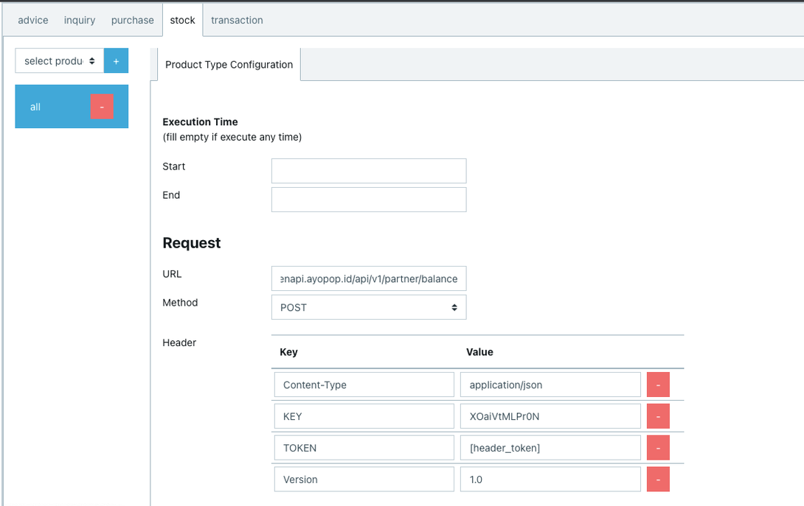
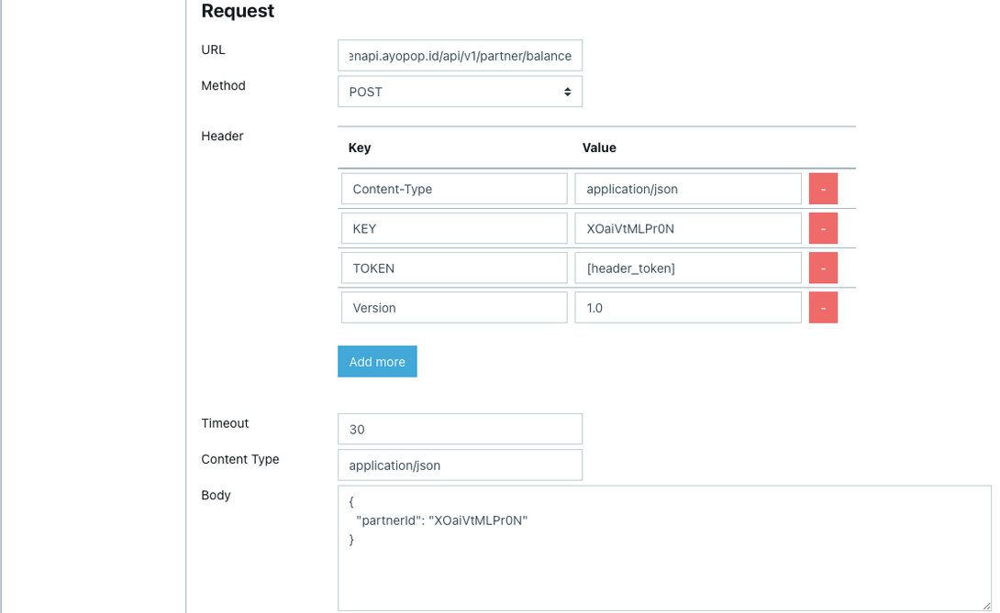
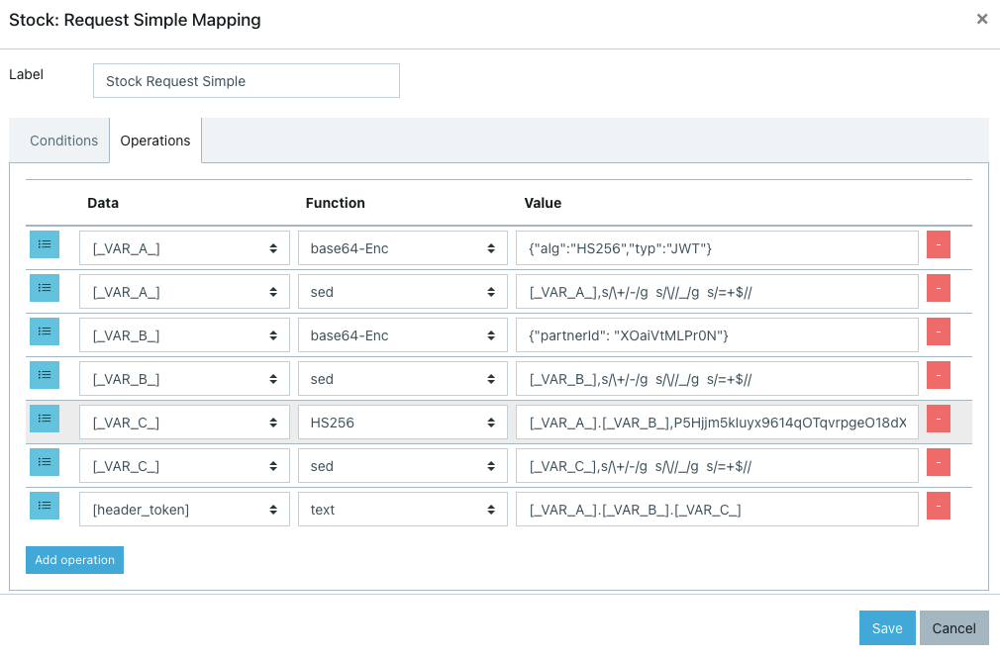
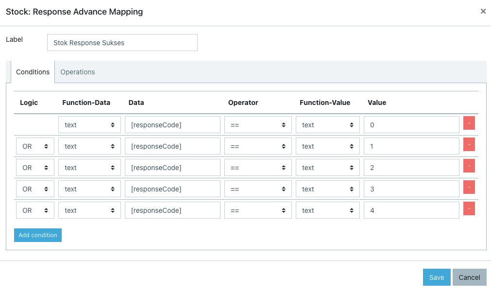
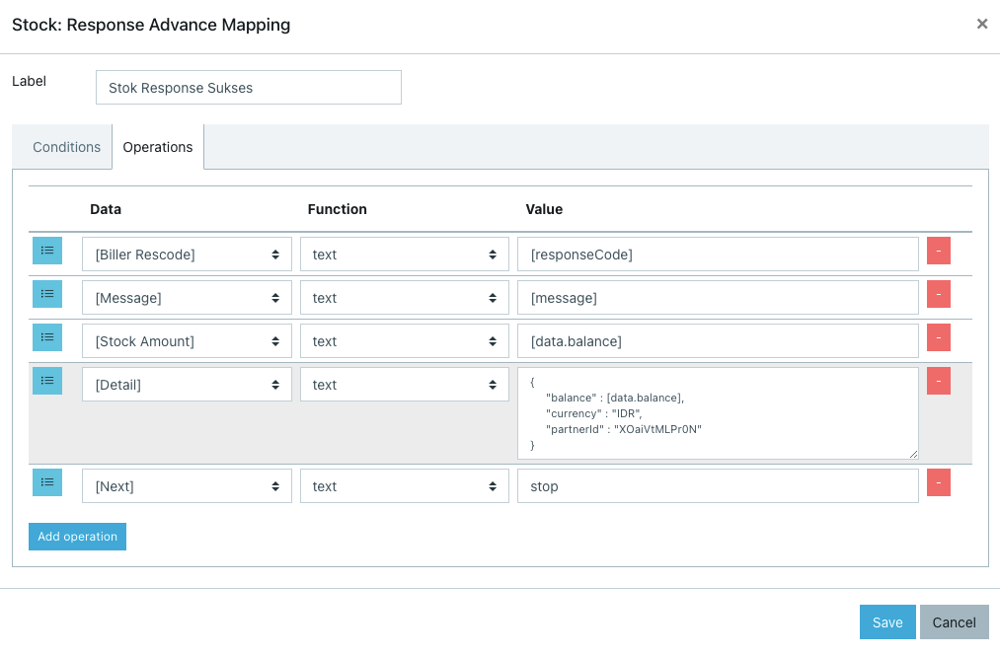

= Cara Konfigurasi Stok di BM

Setelah selesai melakukan _hit_ API _Balance_, langkah selanjutnya adalah _konfigurasi_ stok di BM. _Command_ dan _Product type configuration_ ini akan diklasifikasikan menjadi 3 (tiga) bagian di antaranya.

* URL dan _Body Request_
* _Request Mapping_
* _Response Mapping_

== *URL dan Body Request*

Ikuti langkah-langkah di bawah ini untuk melakukan konfigurasi URL & _Body Request_.

* Masukkan URL yang diterima dari Biller
* _Body request_ diisi sesuai dengan kebutuhan yang akan digunakan Biller. Berikut adalah contoh pengisiannya.

== *Request Mapping*

_Request Mapping_ digunakan untuk memetakan data dari Alterra & Biller. Hal ini dilakukan sebagai _requirement_ mengirimkan _request_ dari Alterra ke Biller, seperti contoh di bawah ini. 

== *Response Mapping*

_Response Mapping_ digunakan untuk memetakan data  yang dikirim oleh Biller. Selanjutnya data tersebut akan dipetakan menggunakan parameter dari Alterra seperti contoh di bawah ini. 

**_IMPORTANT_!**: Tonton https://drive.google.com/file/d/1jvA2ILolUJs5ZelXWhiJE1iTa3d1rPv0/view[**video tutorial**] ini ya.

== *Topik terkait*

Sebelumnya: link:../Cara-Hit-API-Balance-Direct-ke-Biller-Menggunakan-Postman.adoc[Cara _hit_ API _Balance_ _Direct_ ke Biller menggunakan Postman]

Selanjutnya: link:../Cara-Melakukan-Pengecekan-Sisa-Stok-di-BM.adoc[Cara melakukan pengecekan sisa stok di BM]
