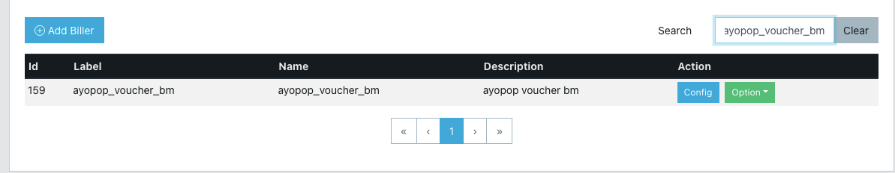
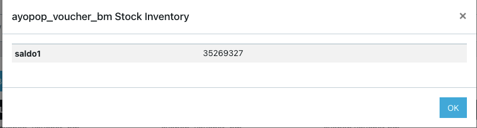

= Cara Melakukan Pengecekan Sisa Stok di BM

Setelah selesai melakukan tahap konfigurasi stok di translator BM, proses selanjutnya adalah mengecek di Translator BM sesuai langkah di bawah ini.

1. Buka Sentinel pada URL https://horven-web.sumpahpalapa.com/login?ref=%2Fbiller[Sentinel-Admin] 
2. Cari nama Biller yang akan dicek stoknya, contoh: Ayopop_voucher_bm 
+

3. Klik tombol option, lalu pilih stock. Selanjutnya laman akan menampilkan seperti gambar di bawah ini.
+

**_IMPORTANT_!**: Tonton https://drive.google.com/file/d/1jvA2ILolUJs5ZelXWhiJE1iTa3d1rPv0/view[**video tutorial**] ini ya. (dari menit ke 19.15)

== *Topik terkait*

link:../Cara-Konfigurasi-Stok-di-BM.adoc[Cara konfigurasi stok di BM]
