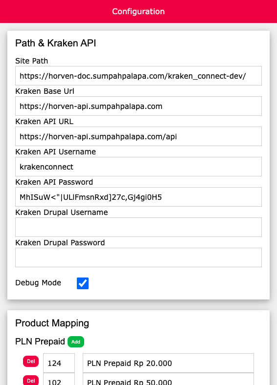

= Cara Setting Produk Sebelum Di-test

Setelah menyiapkan kebutuhan _testing_, langkah selanjutnya adalah _setting_ produk yang telah disiapkan ke krakenconnect. _Setting_ perlu dilakukan dulu karena krakenconnect belum tentu bisa _hit_ sesuai dengan produk yang dibutuhkan. 

Oleh sebab itu, perlu dilakukan _setting_ terlebih dahulu. Namun, apabila sebelumnya sudah melakukan _setting_, maka langkah berikutnya adalah melakukan cek ulang. Berikut adalah langkah-langkah untuk _setting_ produk di krakenconnect.

1. Akses ke halaman _config_ krakenconnect
2. Konfigurasi kebutuhan yang telah dikumpulkan pada tahap sebelumnya, seperti gambar di bawah ini.

**_IMPORTANT_!**: Tonton https://drive.google.com/file/d/1p8uoVYK9vVL8Y5RaciFLK4Eok4u1B_0E/view[**video tutorial**] ini ya.

== *Topik terkait*

- Sebelumnya: link:../Persiapan-Testing-Biller-Menggunakan-Screen-UI.adoc[Persiapan testing Biller menggunakan screen UI (krakenconnect UI)]
- Selanjutnya: link:../Cara-Testing-Produk-menggunakan-krakenconnect-UI.adoc[Cara testing menggunakan krakenconnect UI]
