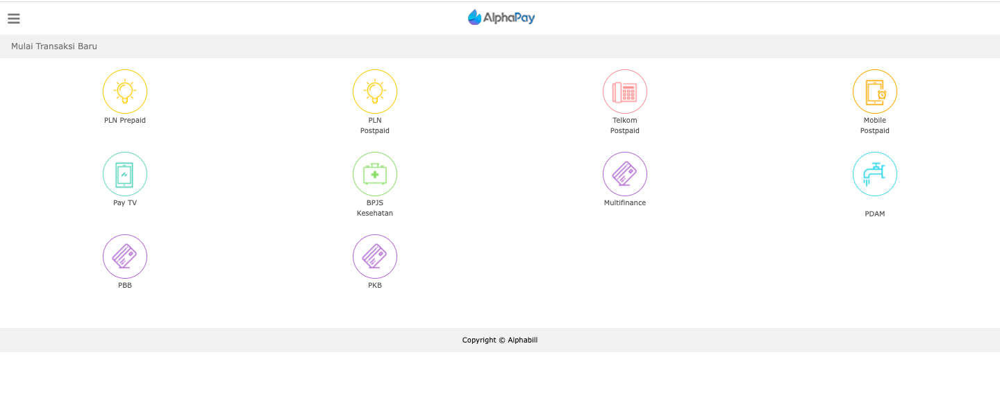
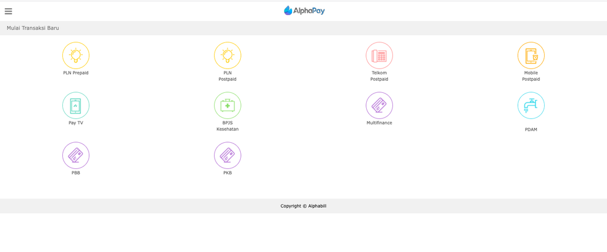

= Cara Testing Produk menggunakan krakenconnect UI

Langkah selanjutnya adalah melakukan _testing_ Biller menggunakan krakenconnect sesuai skenario, _sample screen_ dan _mock_ ID Biller. Ada hal yang harus diperhatikan untuk penggunaan  server (_staging_ dan _production_) pada _testing_ Biller sesuai proses integrasi. Keduanya terlihat identik, namun URL akses dan _credential_  atau product ID yang digunakan berbeda.

Berikut adalah tampilan di server _staging_.

Berikut adalah tampilan di server _production_.

1. Berikut ini adalah langkah-langkah _testing_ yang harus dilakukan. 
2. Pilih produk sesuai produk yang akan diintegrasikan atau di-_test_
3. Konfigurasi _Inquiry_ (jika ada)
4. Konfigurasi _payment_
5. _Get order list_ atau struk

**_IMPORTANT_!**: Tonton https://drive.google.com/file/d/13V1HxrymYJN9mTxMwt46Ipxp7VlZR7Wz/view[**video tutorial**] ini ya.

== *Topik terkait*

link:../Cara-Setting-Produk-Sebelum-Di-test.adoc[Cara setting produk sebelum di-test]
