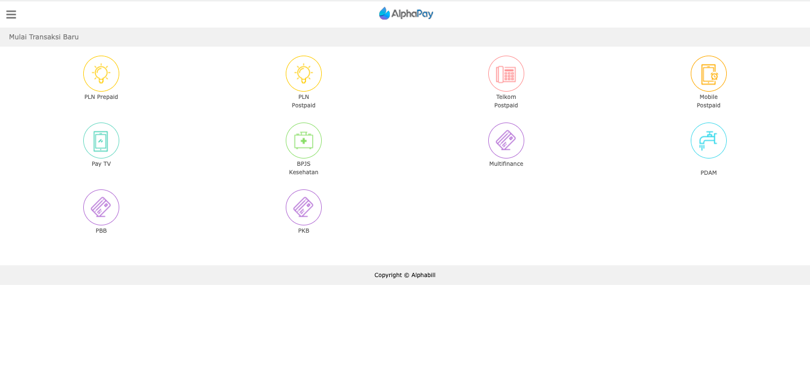

= Persiapan Testing Biller Menggunakan Screen UI (krakenconnect UI)

Persiapan sebelum melakukan __testing__ menggunakan krakenconnect UI pada umumnya tidak jauh berbeda dengan _testing_ Biller ketika menggunakan Postman atau _testing_ API. Berikut adalah beberapa hal yang harus disiapkan.

1. _Screen_ UI sample dari Biller
2. _Mock_ ID _testing_
3. Produk yang akan di-_testing_ sudah di-_mapping_ ke _package_ Partner _testing_
4. Pastikan sudah terhubung dengan VPN Jakarta
5. Akses https://horven-doc.sumpahpalapa.com/kraken_connect-dev//index.php[Krakenconnect UI] dan akan tampil seperti gambar di bawah ini.

**_IMPORTANT_!**: Tonton https://drive.google.com/file/d/1Bd432W6uOo26e3N3lhUa7BgsMyF-g2eN/view[**video tutorial**] ini ya.

== *Topik terkait*

link:../Cara-Setting-Produk-Sebelum-Di-test.adoc[Cara setting produk sebelum di-test]
