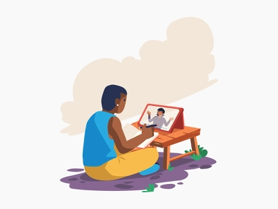

= Integration Support E-Learning

Dari Alterrans, untuk Alterrans. 

_Section_ ini dibuat khusus untuk kamu yang ingin berbagi _knowledge_ kepada rekan kerja baik satu tim maupun lintas divisi. Kali ini giliran tim INTS yang ingin membagikan panduan teknis untuk melakukan proses integrasi Biller dan Partner.

== *Apa saja topik E-Learning yang bisa kamu pelajari di sini?*

Sebelum mulai mempelajari masing-masing topik, pastikan kamu sudah membaca 2 (dua) _guideline_ berikut ini ya.

- link:../../System-Documents/Trunko/user-guide-trunko.adoc[User Guide Trunko] 
- link:../../System-Documents/Oknurt/user-guide-oknurt.adoc[User Guide Oknurt]

Ada 4 topik utama yang bisa dipelajari di sini, meliputi Translator PM, Translator BM, DBS, dan Elisian. Detail masing-masing topik bisa langsung dicek di bawah ini.

* *Translator PM*
** link:./Konfigurasi-PM-Menggunakan-Spek-ISO/index.adoc[Konfigurasi PM Menggunakan Spek ISO]

* *Translator BM*
** link:./Konfigurasi-Stock-Menggunakan-BM/index.adoc[Konfigurasi Stock Menggunakan BM]
** link:./Testing-Biller-Menggunakan-Screen-UI/index.adoc[Testing Biller Menggunakan Screen UI]
** link:./Implementasi-Data-Array-pada-BM-dan-PM/index.adoc[Implementasi Data Array pada BM dan PM]
** Forced to Success Condition in BM Implementation

* *DBS*
** Integrasi Biller Menggunakan DBS

* *Elisian*
** Manual Guide Elisian

== *Apa yang bisa saya lakukan dengan informasi di atas?*

Kalau kamu ada pertanyaan terkait topik ini, jangan ragu untuk menghubungi INTS melalui email guardian@alterra.id
