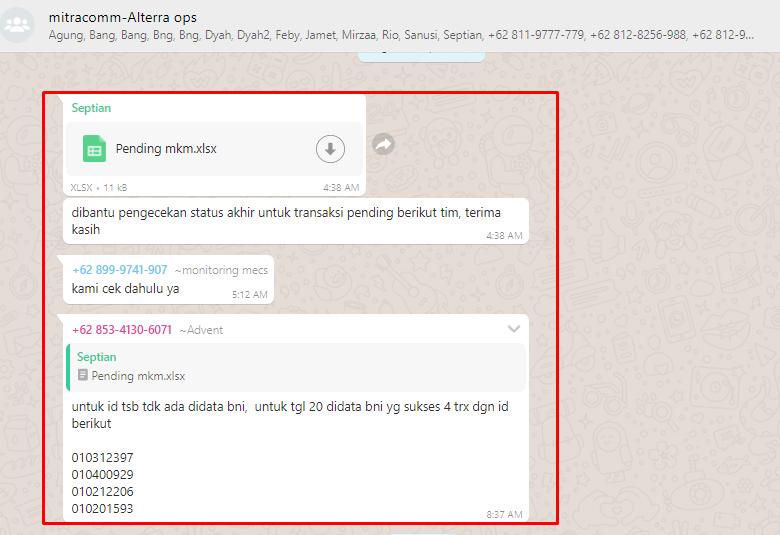
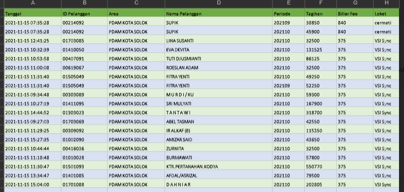
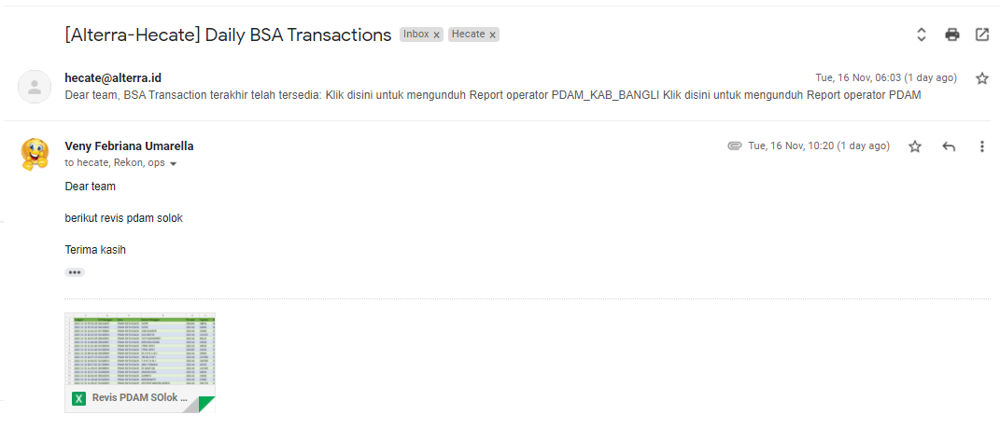

= Cara Melakukan Handling Dispute

Proses _handle dispute_ hanya dilakukan jika ada ketidaksesuaian data transaksi dari Partner dengan data Alterra, baik dari status maupun jumlah transaksinya. Berikut adalah panduan yang harus diikuti untuk menjalankan prosedur _handling dispute_.

1) Terkait perbedaan status transaksi

- Konfirmasi kepada Partner terkait perbedaan status transaksi untuk menentukan status final akan mengikuti data Alterra atau Partner. Lihat contoh di bawah ini

- Jika Partner sudah konfirmasi *data acuan* yang dipakai *dari Partner*, maka lakukan penyesuaian data di sisi Alterra yang pending menjadi sukses. Adapun transaksi _pending_ harus dilakukan _follow up_ ke Partner pada hari-H supaya data transaksi yang di-_update_ masuk di _hecate_ yang dikirim H+1
- Jika Partner konfirmasi *data acuan* menggunakan *dari Alterra*, maka tidak perlu melakukan perubahan data karena yang dikirim sudah bisa final.

2) Terkait selisih jumlah data transaksi

- Jika ada selisih jumlah data, maka harus konfirmasi kepada Partner dua (2) hal berikut.

 -. Apakah status yang didapatkan Partner?
 -. Apakah dari transaksi tersebut perlu dilakukan _flagging_ di sisi Biller?

 - Jika status mengikuti *data Partner*, dan transaksi tidak tercatat di Alterra maka sarankan Partner untuk melakukan hit transaksi agar dalam proses mengirimkan _report_ kepada Biller ada dasar data yang dilakukan untuk rekon.
 - Setelah Partner melakukan _hit_ transaksi, maka pihak Alterra harus mengirimkan report susulan kepada BSA dari data transaksi yang sudah disesuaikan seperti contoh berikut ini.

