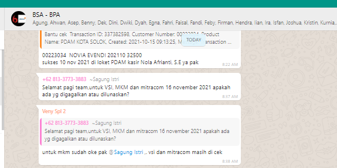

= Cara Melakukan Rekonsiliasi Partner Switching

Berikut adalah panduan yang harus diikuti untuk menjalankan prosedur rekonsiliasi Partner _Switching_.

1) Melakukan penarikan data di Terra sesuai data yang akan direkon pada hari tersebut, contoh: 

- Jika hari ini adalah hari Senin, maka data yang diambil dari Terra adalah periode transaksi Jumat - Minggu dari jam 00:00 - 23:59 (karena _weekend_ tidak ada proses rekon)
- Jika hari ini adalah hari Selasa, maka data yang diambil adalah periode transaksi hari senin dari jam 00:00 - 23:59

_Notes:_ Pastikan Partner yang dipilih sudah sesuai nama Partner yang akan direkon.

2)  Melakukan penarikan data dari Partner via email. Data bisa diambil di email yang sudah dikirim dari Partner. Berikut adalah contoh emailnya:

- MKM →  Rekonsiliasi Transaksi PDAM Kab Bangli
- VSI  →   DATA REKON & SUMMARY REKONSILIASI VSI
- Mitracom → emailnya dari Auto Recon <autorecon@mitracomm.com> akan ada  beberapa email sesuai PDAM yang bertransaksi 

_Note:_ _Download_ data dari Partner

3) Setelah mendapatkan kedua data, maka bisa dilakukan proses rekon dengan membandingkan data dari Alterra dengan Partner

4) Jika semua data sudah sesuai, maka bisa dilakukan konfirmasi kepada Biller BSA bahwa semua data transaksi dari Partner sudah sesuai. Biller bisa menggunakan data transaksi yang sudah dikirim dari Alterra via _Automation Hecate_

5) Konfirmasi kepada Partner dan Biller jika semua data sudah sesuai dengan data Alterra, maka Partner bisa melakukan pelimpahan dana ke PDAM. Berikut adalah contoh konfirmasi yang dilakukan.

