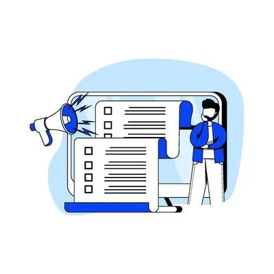

= Guidelines

Apa yang bisa kita lakukan jika mengalami kesulitan atau menemui kendala ketika menyelesaikan pekerjaan? 

Ada banyak cara untuk menyelesaikannya, salah satunya adalah *mencari jawabannya sendiri* dengan *membaca _Guideline_* yang sudah disiapkan khusus buat Alterrans.

_

> Knowledge is our greatest asset. Guides take on the job of helping others by making it accessible and connected.

_

== *Apa saja guidelines yang bisa kamu baca di sini?*

Saat ini, kamu sudah bisa membaca _guidelines_ seperti yang tertulis pada daftar di bawah ini.

- link:./Integration-Support-E-Learning/index.adoc[INTS E-Learning]
- link:./Operations-Guidelines/index.adoc[Operations Guidelines]

*Note*: daftar _guildelines_ akan selalu di-_update_ secara berkala. _Stay tune yaa_.

== *Apa yang bisa saya lakukan dengan informasi di atas?*

- Mau menambahkan atau update guideline untuk Alterrans?
- Butuh bantuan untuk penulisan guideline?

Kamu bisa langsung _submit_ tiket melalui https://support.alterra.id/support/home[Alterra Support].
