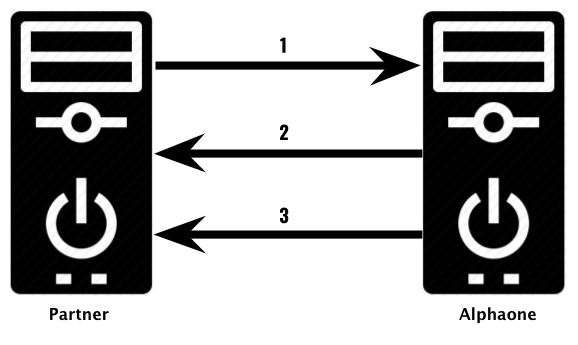

= XML and API

Alphaone dapat terhubung kepada server pulsa yang dimiliki melalui sambungan XML & API. 

Gambar di atas menunjukkan ilustrasi komunikasi data antara Partner dan Alphaone. Berikut adalah penjelasan masing-masing prosesnya:

. Partner  melakukan topupRequest dengan metode XML/ HTTPGET/ JSON ke server Alphaone untuk melakukan transaksi Pulsa, Paket, Voucher Game, E-Wallet, dan sebagainya.

. Alphaone akan merespon transaksi dan memprosesnya jika semua validasi sudah dilewati, atau merespon gagal, jika terdapat kesalahan dalam proses validasi transaksi.

. Alphaone akan mengirimkan status transaksi / callback / reversal / report ke URL Report Partner  berupa HTTPGET/ XML/ JSON sesuai dengan proses request Mitra/ Reseller/ Partner.
