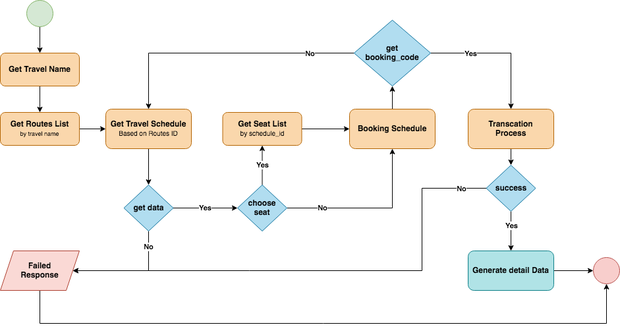

= Travel 

Travel adalah salah satu dari beberapa transportasi darat terlaris kedua setelah bus di Indonesia sampai saat ini. Kemudahan dalam penjualan tiket adalah sasaran utama pasar dan pemilik Perusahaan Minibus dalam meningkatkan pemasaran produk. Pemesanan tiket berbasis online sangat diminati oleh pengguna travel karena sangat memudahkan pengguna dalam pemesanan dan pembayaran dengan detail transaksi yang lengkap.

*Variasi Produk*

- Tiket Travel

*Vendor Utama Produk*

Vendor utama untuk Tiket Travel adalah perusahaan penyedia layanan Travel antar kota, seperti:

- BARAYA
- LINTAS SHUTTLE
- XTRANS
- DAYTRANS
- Aragon Shuttle
- BMA Trans
- Cinta Trans

*Perilaku dan Cara Penggunaan Produk*

. Data hasil cari *_Schedule_* hanya bisa digunakan selama maksimal *_4 Jam (240 Menit)_* untuk dilakukan proses pemesanan
. Proses pemesanan sampai ke pembayaran diberlakukan dalam waktu maksimal *30 menit*
. Tiket anak-anak biasanya diberlakukan dengan harga yang sama dengan Dewasa karena akan mendapatkan tempat duduk sendiri

*Product Journey*

Partner Product Journey Travel Ticket

. Partner memilih nama armada Travel yang diinginkan

. Partner memilih lokasi keberangkatan dan lokasi tujuan

. Partner mencari jadwal Travel dengan menginputkan nilai dari:
.. Nama Armada travel
.. Terminal keberangkatan
.. Terminal tujuan
.. Tanggal keberangkatan

. Partner mendapatkan jadwal Travel dari Kraken sesuai dengan filter yang sudah dimasukkan

. Partner memilih salah satu jadwal yang tersedia

. Jika pihak Travel terdapat fasilitas untuk pilih kursi, maka partner diwajibkan untuk memilih kursi yang tersedia. Jika tidak maka proses akan dilanjutkan ke Booking

. Partner melakukan proses Booking dengan menyesuaikan jadwal yang sudah dipilih sebelumnya

. Partner mendapatkan Kode Booking dan detail pemesanan

. Setelah customer selesai melakukan pembayaran, Partner akan melakukan proses Transaksi (_Issuing Process_) untuk mensukseskan proses booking

. Partner mendapatkan status *_Pending_* dari sistem untuk melakukan proses transaksi

Partner akan mendapatkan status *_Success_* dan detail data Tiket jika proses transaksi sudah selesai dan proses sukses

Partner akan mendapatkan status *_Failed_* jika proses Transaksi gagal

Switcher Product Journey Travel Ticket

. Partner mengirimkan _request_ untuk mengambil list armada Travel

. Sistem mengirimkan list jadwal armada travel

. Partner mengirimkan request lokasi keberangkatan dan tujuan berdasarkan armada Travel yang dipilih

. Sistem mengirimkan list lokasi keberangkatan dan tujuan

. Partner mencari jadwal Travel berdasarkan nama armada Travel, lokasi keberangkatan dan tujuan

. Sistem mengirimkan _request schedule_ ke Biller untuk mendapatkan data _List Schedule_

. Jika proses sukses, maka sistem akan mendapatkan List Schedule untuk dikirimkan langsung ke partner

. Jika partner melakukan proses pilih kursi

. Sistem akan melakukan proses request ke Biller untuk mendapatkan list Availability Seats

. Sistem mendapatkan list Availability Seats dan akan dikirimkan ke Partner

. Partner melakukan proses booking dengan memasukkan data _requester_ dan passengers

. Sistem akan melakukan validasi _request_ , jika proses validasi tidak terdapat error maka sistem akan melakukan _request booking_ ke Biller, jika tidak maka partner akan mendapatkan error dari hasil pengecekan validasi

. Sistem akan mendapatkan respon dari Biller berupa _Booking_Code_ dan juga detail pemesanan. Kemudian data akan langsung dikirimkan ke Partner

. Partner akan mendapatkan _Booking Code_ dan detail pemesanan untuk pengecekan data yang dipesan

. Partner akan _request transaction_ untuk memproses schedule yang sudah dipesan sebelumnya

. Sistem akan mengirimkan _response_ *_Pending_* untuk menginformasikan proses transaksi sedang dilakukan

. Sistem akan melakukan proses _Issuing_ tiket ke Biller untuk mendapatkan data detail Tiket

. Jika proses sukses, maka sistem akan mendapatkan detail data tiket travel yang telah diproses sebelumnya dan akan mengirimkan status *_Success_* ke Partner

. Jika proses gagal, maka sistem akan langsung mengirimkan status *_Failed_* ke Partner