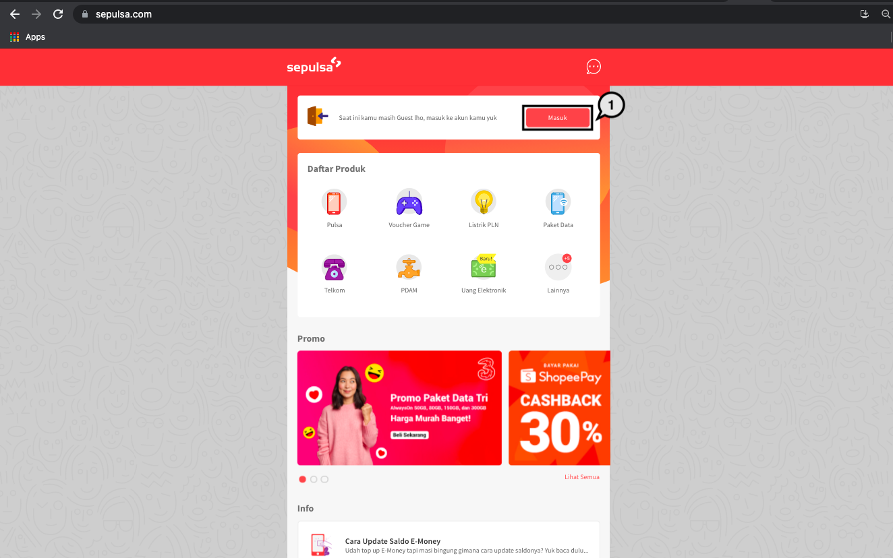
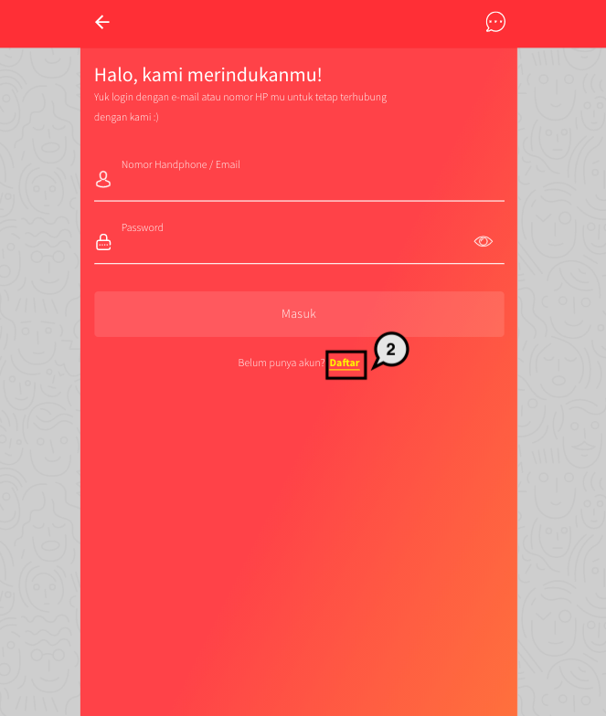
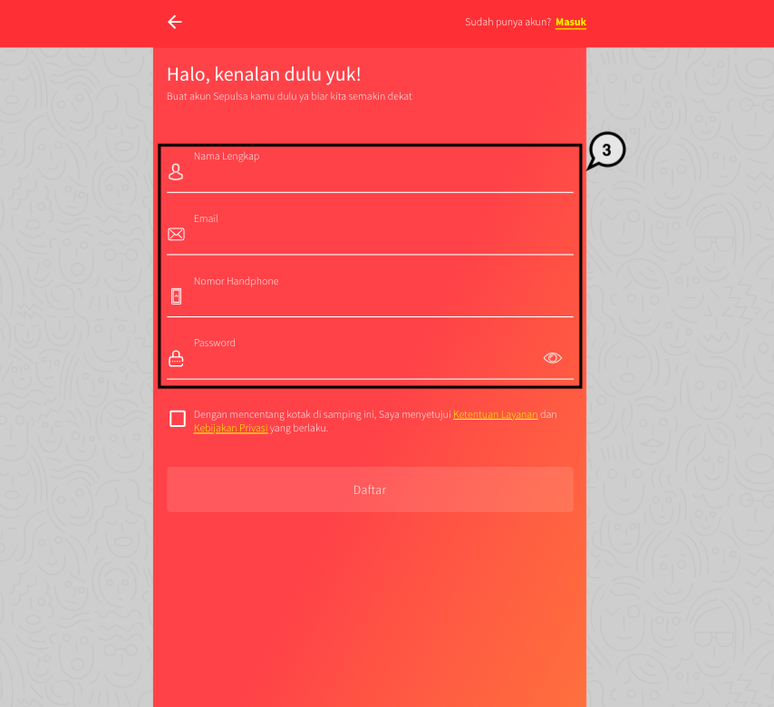
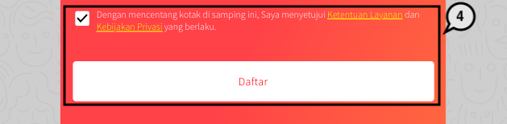
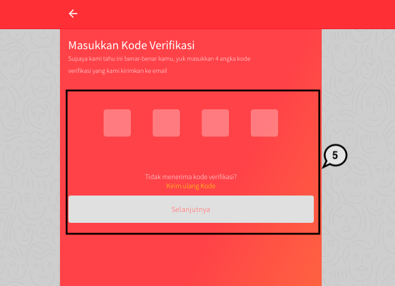

= Getting Started

Dengan bertransaksi di Sepulsa, kamu bisa membayar apa saja yang kamu butuhkan dengan cara berikut:

. Kunjungi website https://www.sepulsa.com/ atau unduh aplikasi Sepulsa pada smartphone yang kamu miliki.
. Pilih produk yang kamu butuhkan.
. Masukkan informasi yang dibutuhkan pada kolom yang tersedia.
. Lakukan pembayaran dengan metode pembayaran yang tersedia dan kamu inginkan.
. Transaksi selesai.

*Registrasi Akun Sepulsa*

. Kunjungi website https://www.sepulsa.com/ kemudian pilih *Masuk*
+

. Klik *Daftar* pada bagian bawah
+

. Masukkan informasi yang dibutuhkan seperti, nama lengkap, email, nomor handphone, dan password
+

. Beri tanda centang pada persetujuan layananan dan kebijakan _privacy_ kemudian klik *Daftar*
+

. Kamu akan diminta memasukkan kode verifikasi yang telah dikirimkan ke email yang telah didaftarkan. Masukkan kode verifikasi kemudian klik *Selanjutnya*
+

. Yay.. Kamu berhasil registrasi akun di Sepulsa dan dapat langsung melakukan transaksi !

