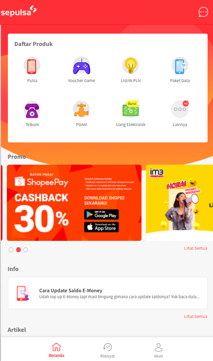

= Sepulsa

Sepulsa adalah platform berbasis website dan aplikasi yang menyediakan jasa pembayaran tagihan rutin dan kebutuhan sehari-hari yang dapat digunakan oleh semua orang secara gratis.

Selain menyediakan layanan berbasis B2C sebagai jasa pembayaran tagihan langsung ke end user, Sepulsa juga terus melakukan inovasi dalam memberikan layanan berbasis B2B untuk memberikan promo-promo menarik kepada mitra yang bekerjasama dengan Sepulsa.

Melalui sepulsa.com kamu dapat melakukan pembayaran tagihan online secara cepat, mudah, dan aman.

Sepulsa tersedia dalam bentuk website https://www.sepulsa.com/ dan mobile app yang bisa diunduh melalui playstore maupun appstore.

*Metode Pembayaran* 

Setiap produk memiliki metode pembayaran yang berbeda-beda dan setiap metode pembayaran juga memiliki minimal pembelian yang berbeda. Berikut metode pembayaran yang didukung oleh Sepulsa:

* Credit Card
.. VISA (BNI)
.. MasterCard (BNI)
.. MasterCard (Mandiri, BNI, BCA)

* Consumer Financing
.. Kredivo
.. IndoDana

* Virtual Account
.. BCA
.. BNI
.. Mandiri
.. Permata

* E-Wallet
.. Gopay
.. LinkAja
.. Shopeepay
.. Vospay
