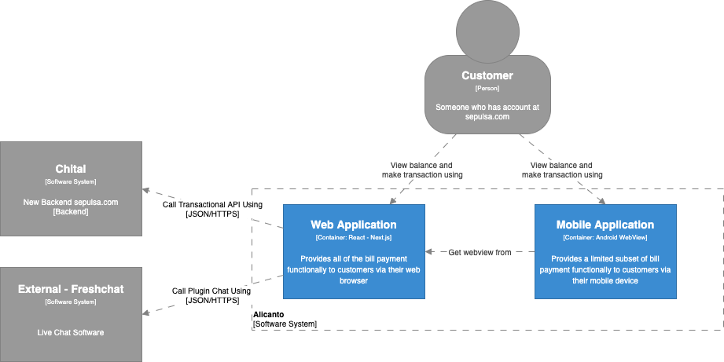

= Architecture Alicanto

== High Level Architecture

Berikut adalah gambar diagram C2 sistem Alicanto:

Sistem ini merupakan bagian dari Sepulsa. Untuk lebih detail terkait hubungan Alicanto dengan sistem Sepulsa lainnya, silakan mengakses <<../../../../../Divisions/Meet-Our-Divisions/Technology/Engineering/Alterra-Systems-C1-Diagram/Sepulsa-C1-Diagram.adoc#,Sepulsa C1 Diagram>> berikut.

== Related Systems

[cols="10%,30%,30%,30%",frame=all, grid=all]
|===
^.^h| *System Name* 
^.^h| *Description* 
^.^h| *Depends on* 
^.^h| *Be a Dependencies to*

|Alicanto
|Front End new Sepulsa
a|1. link:../Chital/index.adoc[Chital] - As BE API
2. Freshchat - As Live Chat
| -
|===