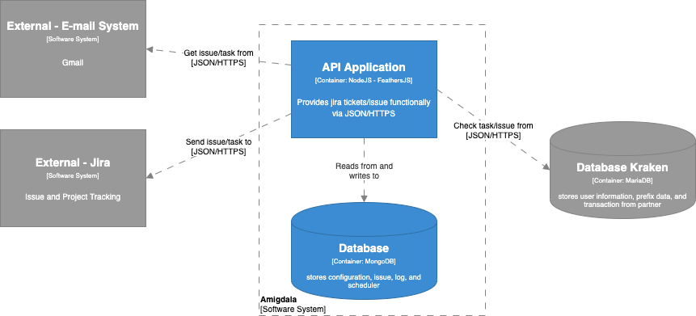

= Architecture Amigdala

== High Level Architecture

Berikut adalah gambar diagram C2 sistem Amigdala:

Sistem ini merupakan bagian dari BPA. Untuk lebih detail terkait hubungan Amigdala dengan sistem BPA lainnya, silakan mengakses <<../../../../../Divisions/Meet-Our-Divisions/Technology/Engineering/Alterra-Systems-C1-Diagram/BPA-C1-Diagram.adoc#,BPA C1 Diagram>> berikut.

== Related System

Amigdala terdiri dari beberapa sistem yang saling terintegrasi. Berikut daftar sistem yang terhubung dengan Amigdala.

[cols="20%,25%,30%,25%",frame=all, grid=all]
|===

^.^h| *System Name* 
^.^h| *Description* 
^.^h| *Depends on* 
^.^h| *Be a Dependencies to*

|Amigdala
|JIRA issue/tickets generator for Ops
a|1. Email (External) - As Issue/Task Provider
2. IRA (External) - As Issue/Task Provider
3. link:../Kraken/index.adoc[Kraken] - As Issue/Task Provider (Database)
| -

|===

