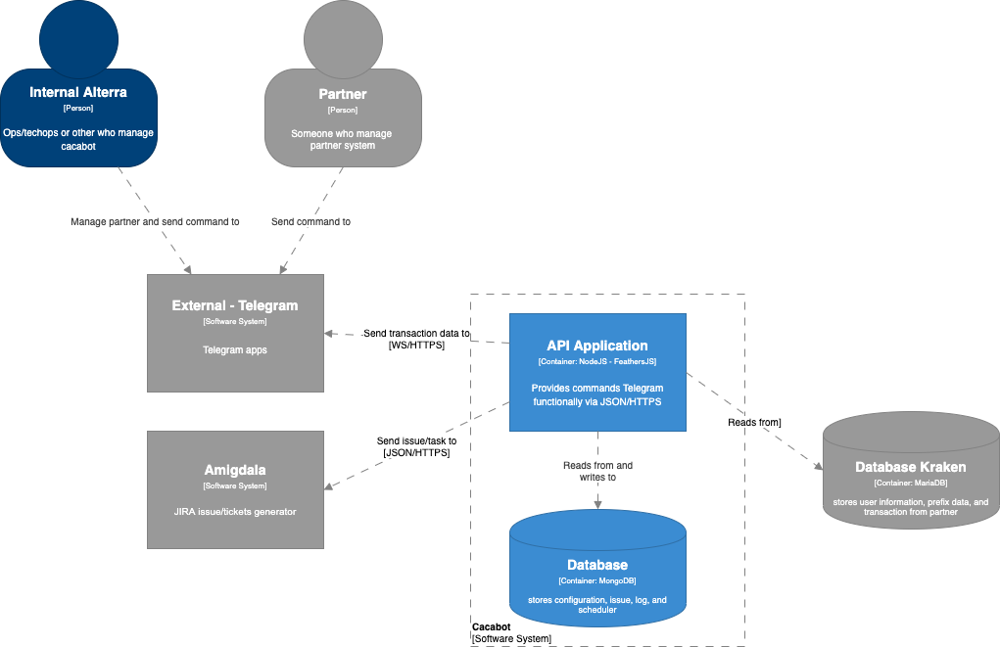

= Architecture Cacabot

Berikut adalah gambar diagram C2 sistem Cacabot:

Sistem ini merupakan bagian dari BPA. Untuk lebih detail terkait hubungan Cacabot dengan sistem Alterra Bills lainnya, silakan mengakses diagram C1 berikut.

== Related System

Cacabot terdiri dari beberapa sistem yang saling terintegrasi. Berikut daftar sistem yang terhubung dengan Cacabot.

[cols="10%,30%,30%,30%",frame=all, grid=all]
|===

^.^h| *System Name*
^.^h| *Description*
^.^h| *Depends on*
^.^h| *Be a Dependencies to*

| Cacabot
a| - Telegram Chatbot Command. Chatbot for Ops and Partner.
- Goals: Displays Kkraken information data to make it easier for Ops and Partners to monitor.
a|1. Telegram (External) - As Chatbot Command
2. Amigdala - As JIRA Issue Generator
| -

|===
