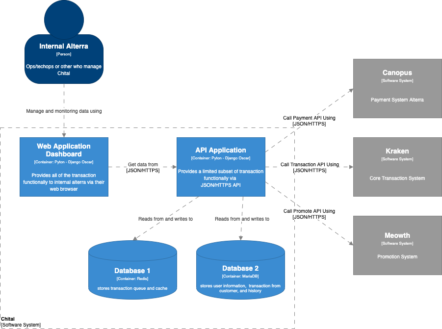
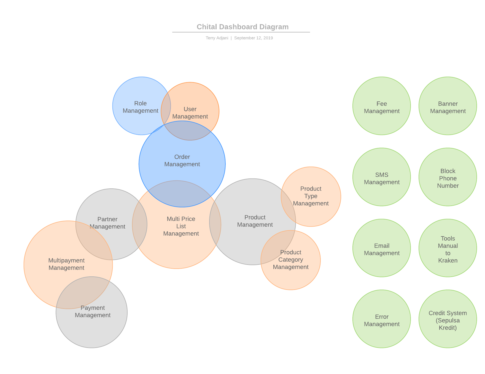
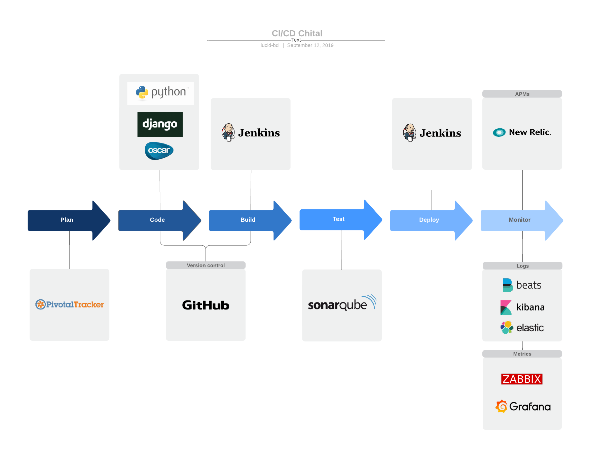
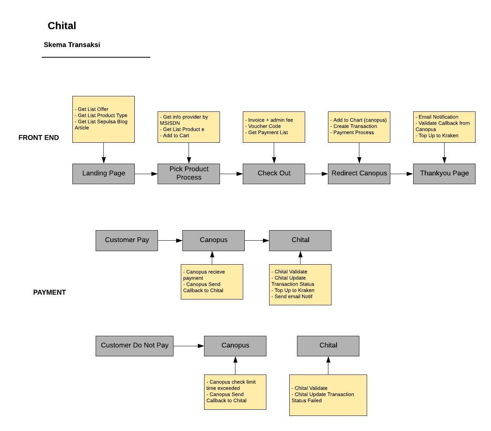
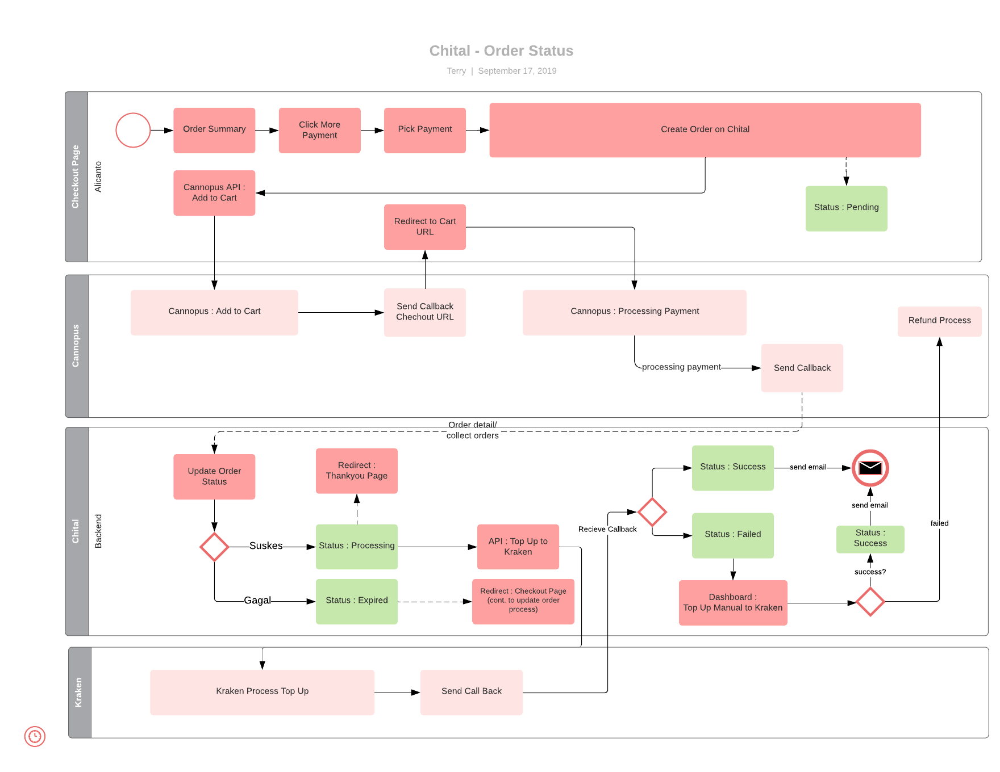

= Architecture Chital

== High Level Diagram

Berikut adalah gambar diagram C2 sistem Chital:

Sistem ini merupakan bagian dari Sepulsa. Untuk lebih detail terkait hubungan Chital dengan sistem Sepulsa lainnya, silakan mengakses <<../../../../../Divisions/Meet-Our-Divisions/Technology/Engineering/Alterra-Systems-C1-Diagram/Sepulsa-C1-Diagram.adoc#,Sepulsa C1 Diagram>> berikut.

== Related Systems

[cols="10%,20%,35%,35%",frame=all, grid=all]
|===
^.^h| *System Name* 
^.^h| *Description* 
^.^h| *Depends on* 
^.^h| *Be a Dependencies to*

|Chital
|Back End, dashboard new Sepulsa
a|1. link:../Kraken/index.adoc[Kraken] - As Bill Payment Aggregator
2. Canopus - As Payment Aggregator
3. link:../Meowth/index.adoc[Meowth] - As Promo Rules & Banner
| -

|===

=== Dashboard

=== CI/CD

=== Transaksi

=== Order Handling

