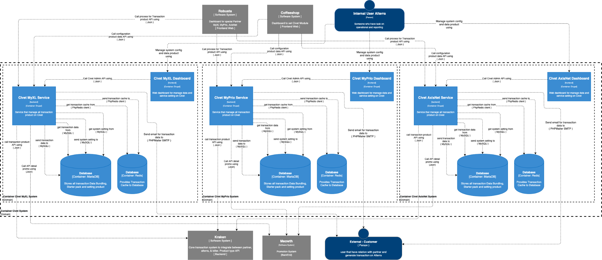

= Architecture Civet

== High Level Architecture

Berikut adalah gambar diagram C2 sistem Civet:

Sistem ini merupakan bagian dari Telco. Untuk lebih detail terkait hubungan Civet dengan sistem Telco lainnya, silakan mengakses <<../../../../../Divisions/Meet-Our-Divisions/Technology/Engineering/Alterra-Systems-C1-Diagram/Telco-C1-Diagram.adoc#,Telco C1 Diagram>> berikut.

== Related Systems

|===

| *System Name* | *Description* | *Depends on* | *Be a Dependencies to*

|Civet
|Clone dari sistem Pronghorn, untuk memproses transaksi dari whitelabel tiap partner yang berbeda-beda
a|1. link:../Kraken/index.adoc[Kraken] - As Bill Payment Aggregator
2. link:../Meowth/index.adoc[Meowth] - As Promo Rules & Banner
a|1. Robusta - As BE APi
2. link:../CoffeeShop/index.adoc[Coffeeshop] - As BE API & Data Master

|===

