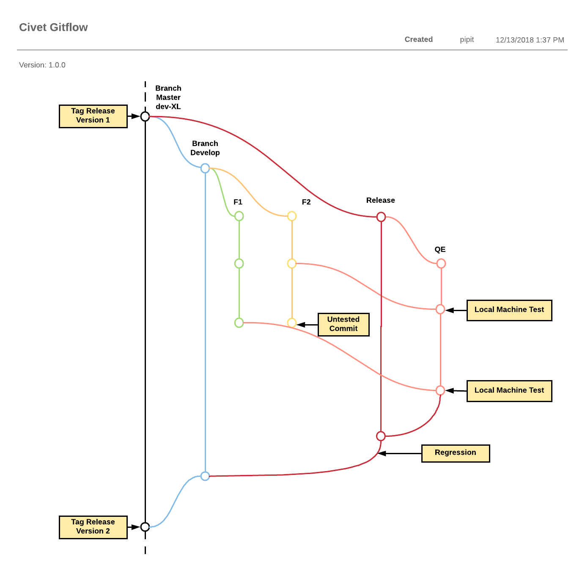

= Development Civet

== Gitflow

== Workflow

Berikut merupakan flow dan wireframe sistem Civet:

https://docs.google.com/spreadsheets/u/1/d/1OyQBW-EYNmhvvK-oWx72Ifx_2ldchPUZdvBpjcgWvWk/edit#gid=0[]

== Development

Hal-hal yang harus diperhatikan Developer ketika mereka _clone_ Civet:

1. Atur Kraken API (_after create partner_ di Kraken).
Di menu Configuration \-> Web Services \-> Kraken API Settings dan di *menu/admin/commerce/config/topup/provider/kraken.*
2. Atur Veritrans Callback.
Tetapkan _client key_ di setiap aturan metode pembayaran dan _set_ Civet _url callback_ di menu Admin Sepulsa Veritrans.
3. _Set_ _email header_ di _mimemail file_(_code_).
4. _Set_ _product package code_ di */admin/commerce/config/product-variation-types/pulsa/fields/field_package_code*.
5. _Set completion message_ untuk _Thank You page_ Frigate di */admin/commerce/config/checkout/form/pane/checkout_completion_message*.
6. _Set tools_ untuk CS and Ops (misalnya, _reprocess transaction_ atau laporan yang diperlukan dari Ops)
7. _Set MDR module_ (opsional jika _partner_ menginginkan _MDR fee_ yang dibayar pelanggan).
