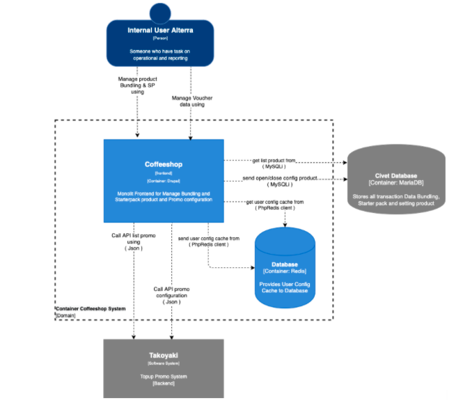
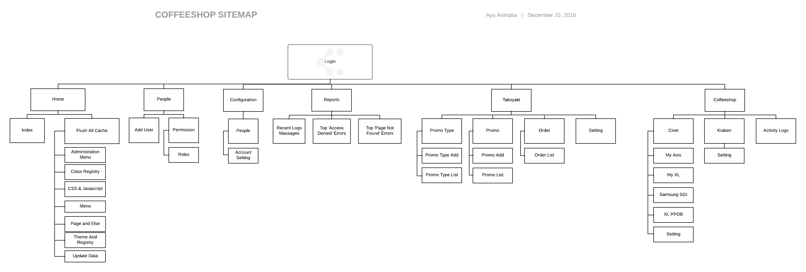

= Architecture CoffeeShop

== High Level Architecture

Berikut adalah gambar diagram C2 sistem CoffeeShop:

Sistem ini merupakan bagian dari Telco. Untuk lebih detail terkait hubungan Coffeeshop dengan sistem Telco lainnya, silakan mengakses https://docs.alterra.id/home/kb-ho/divisions/meet-our-divisions/technology/engineering/alterra-systems-c1-diagram/telco-c1-diagram/[diagram C1 berikut].

== Sitemap

Berikut adalah _sitemap_ dari sistem CoffeeShop:

== Related System

Berikut adalah daftar sistem yang berhubungan dengan CoffeeShop:

|===
| *System Name* | *Description* | *Depends on* | *Be a Dependencies to*

|CoffeeShop
|Dashboard to set Civet Module
a|
. https://docs.alterra.id/home/kb-ho/business-initiatives/alterra-bills/system-documents/civet/[Civet] - As BE API & Data Master
. Takoyaki - As Promo Checker

a|-
|===
