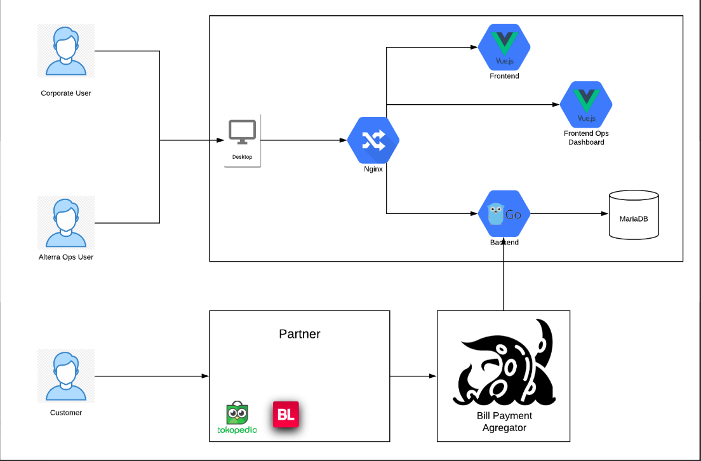
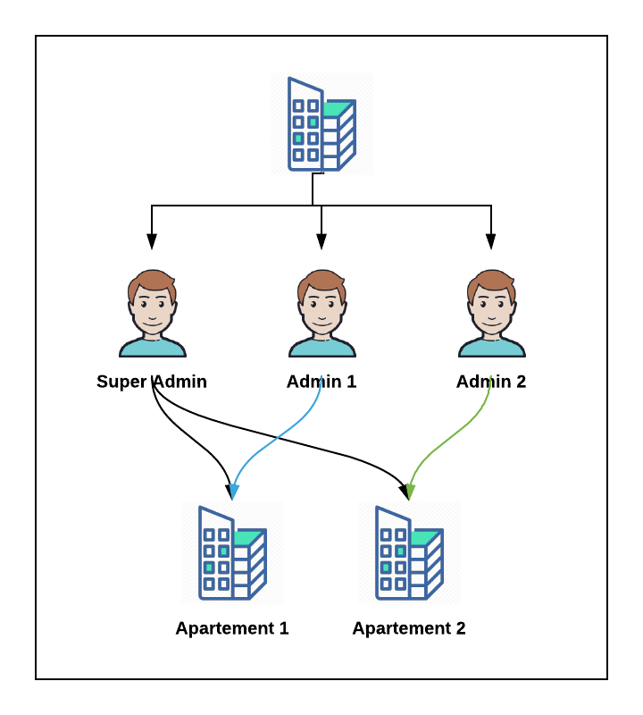
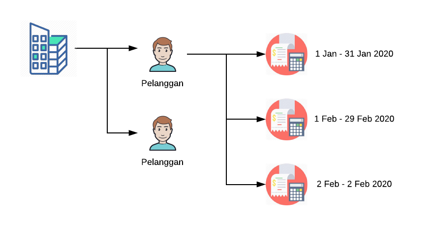
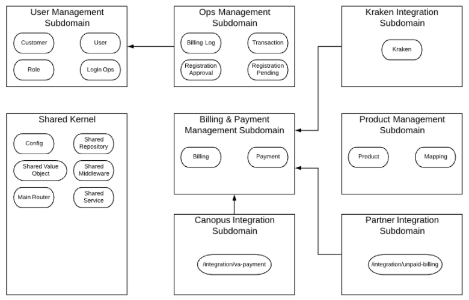
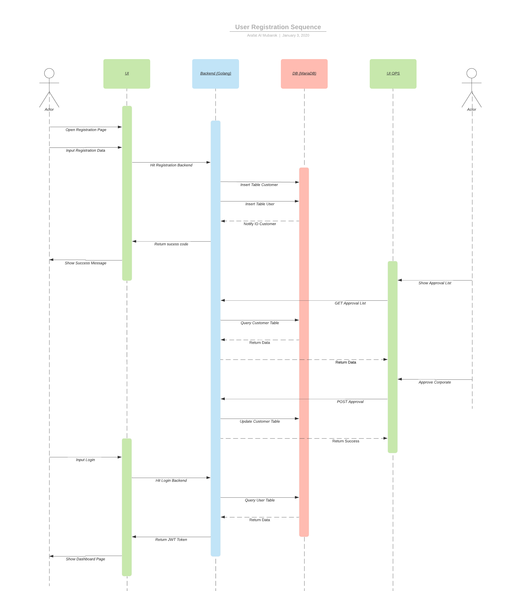
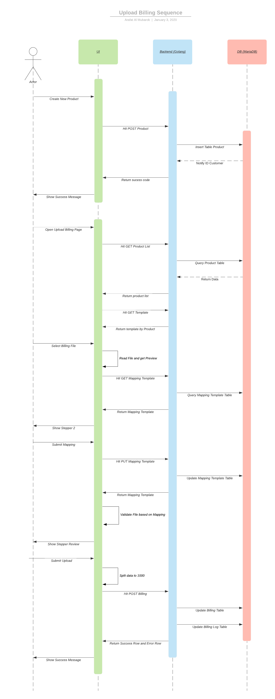
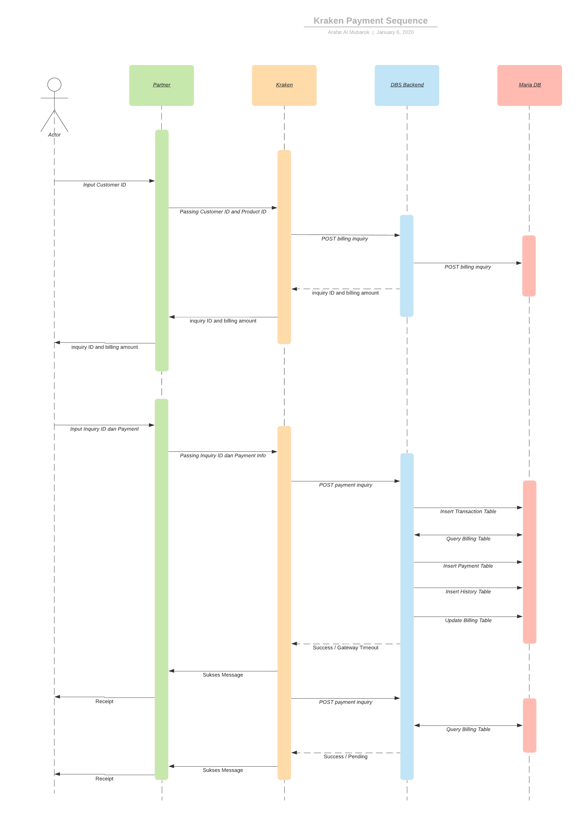
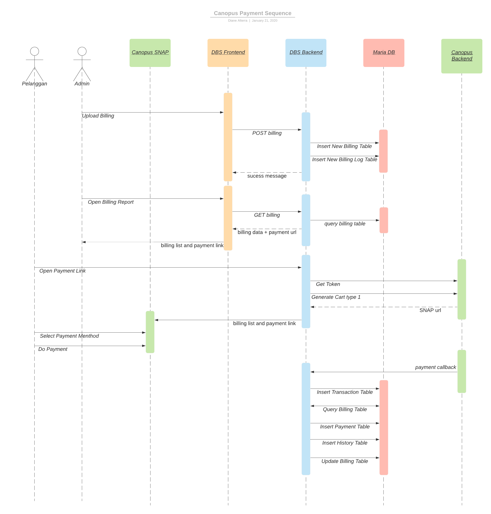
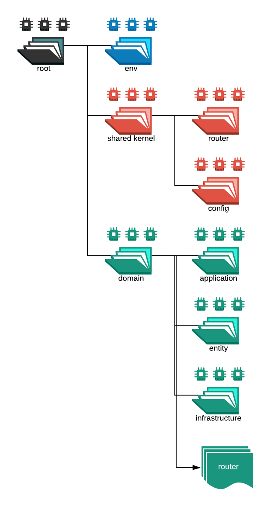

= Architecture Digital Billing System

== High Level Architecture

Berikut merupakan gambar arsitektur _Digital Billing System_ :

== Detail

_Digital Billing System_ terdiri dari beberapa sistem yang saling terintegrasi seperti dalam daftar susunannya di bawah ini:

|===
| *System Name* | *Definition*

| _Frontend_
| _Frontend_ digunakan oleh _user_

| _Frontend Ops Dashboard_
| _Frontend_ untuk digunakan oleh ops BPA untuk memonitor transaksi dalam DBS serta melakukan beberapa _approval_ dan _setting_

| _Backend_
| _Backend_ untuk melakukan proses data dan penyimpanan ke _database_ mariaDB
|===

== Related Systems

Berikut adalah sistem-sistem yang terhubung dengan _Digital Billing System_:

|===
| *System Name* | *Definition*

| Kraken
| Berfungsi sebagai _platform_ untuk _billing_ (_user_ bayar lewat Tokopedia)

| Canopus
| Berfungsi sebagai _payment_ _channel_ (contoh _user_ bayar lewat Alfamart)
|===

== System Concept

=== a. User Concept

Sistem ini menggunakan konsep _multi-tenant_ dengan _corporate_ sebagai satu _tenant_.

* Satu _corporate_ dapat memiliki beberapa _user_.
_User_ diidentifikasi menggunakan _email address_.
* Satu _user_ dapat memiliki akses ke beberapa _product_, baik untuk melihat atau melakukan _upload_ data _billing_.

=== b. Billing Concept

Pada konsep ini, satu _corporate_ memiliki banyak pelanggan.

* Setiap pelanggan dapat memiliki beberapa _billing_.
Setiap _billing_ dikatakan unik jika memiliki _start date_ dan _end date_ yang berbeda.
* Billing dapat memiliki _expired date_ dan tidak dapat dibayar jika berada dan lewat waktu tersebut.
* Tagihan yang harus dibayarkan oleh pelanggan adalah total seluruh tagihan yang tidak _expired_ dan belum dibayar sebelumnya.

== Backend Domain Architecture

Berikut adalah gambar arsitektur _backend domain_ dari _Digital Billing System_ (DBS).

== User Case Flowchart

=== a. User Registration Flow

=== b. Upload Billing

=== c. Billing Payment by Kraken

=== d. Payment by Canopus Flow

== Repository Project Structure

Struktur folder dari proyek ini adalah sebagai berikut:

* *_Env folder_*: folder berisi untuk _setting database_ dan _user_
* *_Shared kernel folder_*: folder yang berisi _file_ atau _utility_ yang digunakan lebih dari satu domain
* *_Domain folder_*: folder berisi _business implementation_ untuk setiap domain

