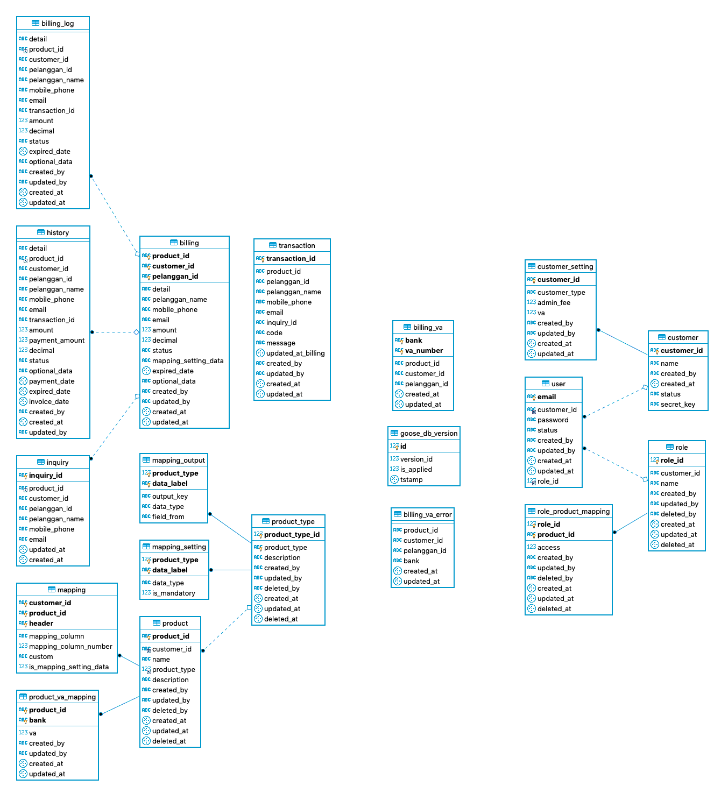

= Database Documentation Digital Billing System

_Database_ pada _Digital Billing System_ (DBS) ini menggunakan _single database_ untuk menyimpan seluruh data dari berbagai _corporate_. Untuk membedakan data antar _corporate_ digunakan _flag_ pada seluruh tabel yang ada.
Berikut ini adalah gambaran ERD untuk data-data yang ada dalam *Digital Billing System*

Berikut ini adalah penjelasan singkat terkait dengan database yang digunakan:

== _Database Billing_

Tabel-tabel berikut ini adalah tabel-tabel yang terkait dengan _service billing_ dan _integration_ ke kraken:

=== 1. _billing_

Tabel ini digunakan untuk menyimpan data _billing_ yang di-_upload_ oleh _user_, tabel _billing_ memiliki 3 _column_ sebagai _primary key_ yaitu pelanggan_id, product_id, dan customer_id.

----

CREATE TABLE `billing` (
  `detail` longtext CHARACTER SET utf8mb4 COLLATE utf8mb4_bin DEFAULT NULL,
  `product_id` varchar(32) NOT NULL,
  `customer_id` varchar(8) NOT NULL,
  `pelanggan_id` varchar(255) NOT NULL,
  `pelanggan_name` varchar(255) DEFAULT NULL,
  `mobile_phone` varchar(25) DEFAULT NULL,
  `email` varchar(255) DEFAULT NULL,
  `amount` bigint(20) unsigned NOT NULL,
  `decimal` int(11) NOT NULL,
  `status` varchar(16) NOT NULL,
  `mapping_setting_data` longtext CHARACTER SET utf8mb4 COLLATE utf8mb4_bin DEFAULT NULL,
  `expired_date` date NOT NULL,
  `optional_data` longtext CHARACTER SET utf8mb4 COLLATE utf8mb4_bin DEFAULT NULL,
  `created_by` varchar(255) DEFAULT NULL,
  `updated_by` varchar(255) DEFAULT NULL,
  `created_at` timestamp NOT NULL DEFAULT current_timestamp() ON UPDATE current_timestamp(),
  `updated_at` timestamp NOT NULL DEFAULT '0000-00-00 00:00:00',
  PRIMARY KEY (`product_id`,`customer_id`,`pelanggan_id`)
) ENGINE=InnoDB DEFAULT CHARSET=utf8mb4;
----

=== 2. _billing_log_

Tabel ini digunakan untuk menyimpan data perubahan _billing_ yang di-_upload_ oleh _user_.
Tabel ini digunakan ketika _user_ ingin melihat perubahan pada data _billing_.

----
CREATE TABLE `billing_log` (
  `detail` longtext CHARACTER SET utf8mb4 COLLATE utf8mb4_bin DEFAULT NULL,
  `product_id` varchar(32) NOT NULL,
  `customer_id` varchar(8) NOT NULL,
  `pelanggan_id` varchar(255) NOT NULL,
  `pelanggan_name` varchar(255) DEFAULT NULL,
  `mobile_phone` varchar(25) DEFAULT NULL,
  `email` varchar(255) DEFAULT NULL,
  `transaction_id` varchar(255) NOT NULL,
  `amount` bigint(20) unsigned NOT NULL,
  `decimal` int(11) NOT NULL,
  `status` varchar(16) NOT NULL,
  `expired_date` date NOT NULL,
  `optional_data` longtext CHARACTER SET utf8mb4 COLLATE utf8mb4_bin DEFAULT NULL,
  `created_by` varchar(255) DEFAULT NULL,
  `updated_by` varchar(255) DEFAULT NULL,
  `created_at` timestamp NOT NULL DEFAULT current_timestamp() ON UPDATE current_timestamp(),
  `updated_at` timestamp NOT NULL DEFAULT '0000-00-00 00:00:00'
) ENGINE=InnoDB DEFAULT CHARSET=utf8mb4;
----

=== 3. _history_

Tabel ini digunakan untuk menyimpan data pembayaran pada suatu _billing_ tertentu.
Tabel ini banyak digunakan untuk _report payment_.

----
CREATE TABLE `history` (
  `detail` longtext CHARACTER SET utf8mb4 COLLATE utf8mb4_bin DEFAULT NULL,
  `product_id` varchar(32) NOT NULL,
  `customer_id` varchar(8) NOT NULL,
  `pelanggan_id` varchar(255) NOT NULL,
  `pelanggan_name` varchar(255) DEFAULT NULL,
  `mobile_phone` varchar(25) DEFAULT NULL,
  `email` varchar(255) DEFAULT NULL,
  `transaction_id` varchar(255) NOT NULL,
  `amount` bigint(20) unsigned NOT NULL,
  `payment_amount` bigint(20) unsigned DEFAULT NULL,
  `decimal` int(11) NOT NULL,
  `status` varchar(16) NOT NULL,
  `optional_data` longtext CHARACTER SET utf8mb4 COLLATE utf8mb4_bin DEFAULT NULL,
  `payment_date` timestamp NOT NULL DEFAULT current_timestamp() ON UPDATE current_timestamp(),
  `expired_date` date NOT NULL,
  `invoice_date` timestamp NOT NULL DEFAULT '0000-00-00 00:00:00',
  `created_by` varchar(255) DEFAULT NULL,
  `created_at` timestamp NULL DEFAULT NULL,
  `updated_by` varchar(255) DEFAULT NULL
) ENGINE=InnoDB DEFAULT CHARSET=utf8mb4;
----

=== 4. _inquiry_

Tabel ini digunakan untuk menyimpan data _inquiry_ ketika Kraken melakukan _inquiry_ pada data _billing_.
_Inquiry_ ini akan terhubung dengan tabel _billing_ menggunakan pelanggan_id, product_id, dan customer_id.

----
CREATE TABLE `inquiry` (
  `product_id` varchar(32) NOT NULL,
  `customer_id` varchar(8) NOT NULL,
  `pelanggan_id` varchar(255) NOT NULL,
  `pelanggan_name` varchar(255) DEFAULT NULL,
  `mobile_phone` varchar(25) DEFAULT NULL,
  `email` varchar(255) DEFAULT NULL,
  `inquiry_id` varchar(255) NOT NULL,
  `updated_at` timestamp NOT NULL DEFAULT current_timestamp() ON UPDATE current_timestamp(),
  `created_at` timestamp NOT NULL DEFAULT current_timestamp(),
  PRIMARY KEY (`inquiry_id`)
) ENGINE=InnoDB DEFAULT CHARSET=utf8mb4;
----

=== 5. _transaction_

Tabel ini digunakan untuk menyimpan data _transaction_ yang dikirim Kraken ketika melakukan pembayaran dan untuk menampilkan _transaction history_ ketika ada _dispute_ dengan Kraken serta melakukan _query check_ status pada Kraken ketika ada _case timeout_.

----
CREATE TABLE `transaction` (
  `transaction_id` varchar(255) NOT NULL,
  `product_id` varchar(32) NOT NULL,
  `pelanggan_id` varchar(255) NOT NULL,
  `pelanggan_name` varchar(255) DEFAULT NULL,
  `mobile_phone` varchar(25) DEFAULT NULL,
  `email` varchar(255) DEFAULT NULL,
  `inquiry_id` varchar(255) NOT NULL,
  `code` varchar(255) NOT NULL,
  `message` varchar(255) NOT NULL,
  `updated_at_billing` timestamp NOT NULL DEFAULT current_timestamp() ON UPDATE current_timestamp(),
  `created_by` varchar(255) DEFAULT NULL,
  `updated_by` varchar(255) DEFAULT NULL,
  `created_at` timestamp NOT NULL DEFAULT '0000-00-00 00:00:00',
  `updated_at` timestamp NOT NULL DEFAULT '0000-00-00 00:00:00',
  UNIQUE KEY `transaction_id` (`transaction_id`)
) ENGINE=InnoDB DEFAULT CHARSET=utf8mb4;
----

== _Database Mapping_

Berikut ini adalah tabel - tabel yang terkait dengan mapping file dari excel untuk dimasukkan kedalam database.

=== 1. _product type_

Tabel ini digunakan untuk menyimpan data _product_type.
Product type_ sejalan dengan _product_type_ dari Kraken yang memiliki data-data _mandatory_ maupun _optional_ yang _unique_.

----
CREATE TABLE `product_type` (
  `product_type_id` int(11) NOT NULL AUTO_INCREMENT,
  `product_type` varchar(255) NOT NULL,
  `description` varchar(512) DEFAULT NULL,
  `created_by` varchar(255) DEFAULT NULL,
  `updated_by` varchar(255) DEFAULT NULL,
  `deleted_by` varchar(255) DEFAULT NULL,
  `created_at` timestamp NULL DEFAULT NULL,
  `updated_at` timestamp NULL DEFAULT NULL,
  `deleted_at` timestamp NULL DEFAULT NULL,
  PRIMARY KEY (`product_type_id`),
  UNIQUE KEY `product_type` (`product_type`)
) ENGINE=InnoDB AUTO_INCREMENT=8 DEFAULT CHARSET=utf8mb4;
----

=== 2. _product_

Tabel ini digunakan untuk menyimpan data _product_, setiap _product_ akan memiliki _product_type_ untuk menentukan data apa yang dibutuhkan.

----
CREATE TABLE `product` (
  `product_id` varchar(32) NOT NULL,
  `customer_id` varchar(8) NOT NULL,
  `name` varchar(255) NOT NULL,
  `product_type` int(11) NOT NULL,
  `description` varchar(512) DEFAULT NULL,
  `created_by` varchar(255) DEFAULT NULL,
  `updated_by` varchar(255) DEFAULT NULL,
  `deleted_by` varchar(255) DEFAULT NULL,
  `created_at` timestamp NULL DEFAULT NULL,
  `updated_at` timestamp NULL DEFAULT NULL,
  `deleted_at` timestamp NULL DEFAULT NULL,
  PRIMARY KEY (`product_id`),
  UNIQUE KEY `cusidname` (`customer_id`,`name`)
) ENGINE=InnoDB DEFAULT CHARSET=utf8mb4;
----

=== 3. _mapping_output_

Tabel ini digunakan untuk menyimpan data _mapping_ untuk mengirim data ke Kraken

----
CREATE TABLE `mapping_output` (
  `product_type` int(11) NOT NULL AUTO_INCREMENT,
  `data_label` varchar(50) NOT NULL,
  `output_key` varchar(20) DEFAULT NULL,
  `data_type` varchar(25) DEFAULT NULL,
  `field_from` varchar(25) DEFAULT NULL,
  PRIMARY KEY (`product_type`,`data_label`)
) ENGINE=InnoDB AUTO_INCREMENT=8 DEFAULT CHARSET=utf8mb4;
----

=== 4. _mapping_setting_

Tabel ini digunakan untuk menyimpan data _mapping_ untuk mendapatkan data _mapping setting_ untuk _upload_ data

----
CREATE TABLE `mapping_setting` (
  `product_type` int(11) NOT NULL AUTO_INCREMENT,
  `data_label` varchar(20) NOT NULL,
  `data_type` varchar(25) DEFAULT NULL,
  `is_mandatory` int(11) DEFAULT NULL,
  PRIMARY KEY (`product_type`,`data_label`)
) ENGINE=InnoDB AUTO_INCREMENT=8 DEFAULT CHARSET=utf8mb4;
----

=== 5. _mapping_

Tabel ini digunakan untuk menyimpan data _mapping_.
_Mapping_ digunakan untuk _dictionary_ untuk menterjemahkan data excel _customer_ dengan _header_ yang beragam kedalam disistem *Digital Billing System*

----
CREATE TABLE `mapping` (
  `customer_id` varchar(8) NOT NULL,
  `product_id` varchar(32) NOT NULL,
  `header` varchar(255) NOT NULL,
  `mapping_column` varchar(255) DEFAULT NULL,
  `mapping_column_number` int(11) DEFAULT NULL,
  `custom` varchar(64) DEFAULT NULL,
  `is_mapping_setting_data` int(11) DEFAULT NULL,
  PRIMARY KEY (`customer_id`,`product_id`,`header`)
) ENGINE=InnoDB DEFAULT CHARSET=utf8mb4;
----

== _Database User_

Berikut ini adalah tabel-tabel yang terkait dengan _user management_

=== 1. _customer_

Tabel ini digunakan untuk menyimpan data _customer / corporate_

----
CREATE TABLE `customer` (
  `customer_id` varchar(8) NOT NULL,
  'name` varchar(255) NOT NULL,
  `created_by` varchar(255) DEFAULT NULL,
  `created_at` timestamp NULL DEFAULT NULL,
  `status` varchar(16) NOT NULL,
  `secret_key` varchar(30) DEFAULT NULL,
  PRIMARY KEY (`customer_id`)
) ENGINE=InnoDB DEFAULT CHARSET=utf8mb4;
----

=== 2. _customer_setting_

Tabel ini digunakan untuk menyimpan data _setting_ yang fix setiap _customer_, seperti _admin fee_ dan _setting payment_

----
CREATE TABLE `customer_setting` (
  `customer_id` varchar(8) NOT NULL,
  `customer_type` varchar(255) NOT NULL,
  `admin_fee` int(11) NOT NULL,
  `va` tinyint(1) NOT NULL,
  `created_by` varchar(255) DEFAULT NULL,
  `updated_by` varchar(255) DEFAULT NULL,
  `created_at` timestamp NULL DEFAULT NULL,
  `updated_at` timestamp NULL DEFAULT NULL,
  PRIMARY KEY (`customer_id`)
) ENGINE=InnoDB DEFAULT CHARSET=utf8mb4;
----

=== 3. _user_

Tabel ini digunakan untuk menyimpan data _user_, baik itu data pribadi maupun _credential_ seperti _email_ dan _password_.
_Password_ akan di _hash_ menggunakan _bycrypt_

----
CREATE TABLE `user` (
  `customer_id` varchar(8) NOT NULL,
  `email` varchar(255) NOT NULL,
  `password` varchar(255) NOT NULL,
  `status` varchar(16) NOT NULL,
  `created_by` varchar(255) DEFAULT NULL,
  `updated_by` varchar(255) DEFAULT NULL,
  `created_at` timestamp NULL DEFAULT NULL,
  `updated_at` timestamp NULL DEFAULT NULL,
  `role_id` int(11) NOT NULL,
  PRIMARY KEY (`email`)
) ENGINE=InnoDB DEFAULT CHARSET=utf8mb4;
----

=== 4. _role_

Tabel ini digunakan untuk menyimpan data _role_ yang dibuat

----
CREATE TABLE `role` (
  `role_id` int(11) NOT NULL AUTO_INCREMENT,
  `customer_id` varchar(8) NOT NULL,
  `name` varchar(255) NOT NULL,
  `created_by` varchar(255) DEFAULT NULL,
  `updated_by` varchar(255) DEFAULT NULL,
  `deleted_by` varchar(255) DEFAULT NULL,
  `created_at` timestamp NULL DEFAULT NULL,
  `updated_at` timestamp NULL DEFAULT NULL,
  `deleted_at` timestamp NULL DEFAULT NULL,
  PRIMARY KEY (`role_id`)
) ENGINE=InnoDB AUTO_INCREMENT=10003 DEFAULT CHARSET=utf8mb4;
----

=== 5. _role_product_mapping_

Tabel ini digunakan untuk menyimpan data detail untuk _product_ mana saja yang boleh di akses oleh _role_ tertentu

----
CREATE TABLE `role_product_mapping` (
  `role_id` int(11) NOT NULL AUTO_INCREMENT,
  `product_id` varchar(32) NOT NULL,
  `access` int(11) NOT NULL,
  `created_by` varchar(255) DEFAULT NULL,
  `updated_by` varchar(255) DEFAULT NULL,
  `deleted_by` varchar(255) DEFAULT NULL,
  `created_at` timestamp NULL DEFAULT NULL,
  `updated_at` timestamp NULL DEFAULT NULL,
  `deleted_at` timestamp NULL DEFAULT NULL,
  PRIMARY KEY (`role_id`,`product_id`),
  CONSTRAINT `role_product_mapping_role_id_role_role_id_foreign` FOREIGN KEY (`role_id`) REFERENCES `role` (`role_id`) ON DELETE CASCADE ON UPDATE CASCADE
) ENGINE=InnoDB AUTO_INCREMENT=10003 DEFAULT CHARSET=utf8mb4;
----
