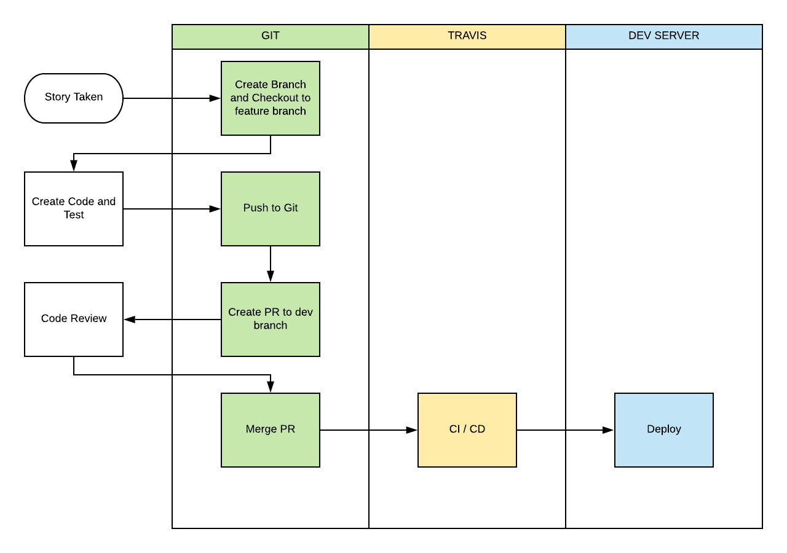

= Developer Onboarding Digital Billing System

== Local Machine Setup

=== Coding Flow

=== How To Run This Code

==== Run on local computer

Langkah - langkah menjalankan _Digital Billing System_ secara manual tanpa menggunakan Docker:

. _install_ MariaDB
. buat _database_ "digital_billing_system"
. ubah AppPath di `config/app.go` dengan _working directory_-mu
. ubah dirFile di `handlers/base.go` dengan _working directory_-mu
. masuk ke `run main.go` (_to automigrate table_)
. tambahkan _dump default user_: `$ goose mysql "root:alterra123@tcp(127.0.0.1:3306)/digital_billing_system?charset=utf8&parseTime=True&loc=Local"` up
. masuk ke run main.go
. uji (test) API

==== Run on server using docker

Berikut adalah langkah - langkah untuk melakukan run on server menggunakan docker.

. _clone_ repo ini ke server
. pastikan sudah ter-_install_ docker dan docker-compose dengan melakukan `docker --version`
. jalankan aplikasi dengan `docker-compose up -d`

==== Run testing

Berikut adalah langkah - langkah untuk melakukan unit test.

. masuk ke directory `github.com/alterra/DBS`
. jalankan `$ go run main.go` di terminal (untuk menjalankan _automigrate_)
. jalankan `$ goose mysql "root:alterra123@tcp(127.0.0.1:3306)/digital_billing_system?charset=utf8&parseTime=True&loc=Local" down` di terminal (untuk membersihkan semua _records_ dalam _database_)
. jalankan `$ goose mysql "root:alterra123@tcp(127.0.0.1:3306)/digital_billing_system?charset=utf8&parseTime=True&loc=Local" up` di terminal (untuk _hardcode_ memasukkan _seed data_ ke _database_)
. jalankan `$ cd ../..` di terminal (untuk kembali ke direktori awal)
. jalankan `+$ go test -v ./.../application -coverprofile=coverage.out && go tool cover -html=coverage.out -o coverage.html+`
. _coverage_ dapat dilihat pada _coverage.html_ dan _coverage.out_

Berikut dokumentasi _installation setup_ serta _tools_ yang digunakan pada _Digital Billing System_:

____
https://github.com/sepulsa/digital_billing_system[https://github.com/sepulsa/digital_billing_system]
____
