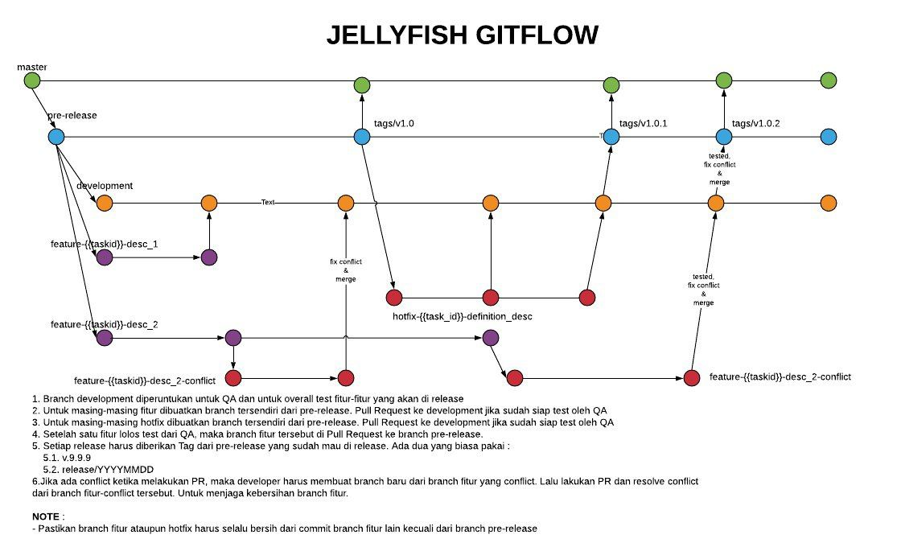

= Development Digital Billing System

== Source Code

____
https://github.com/sepulsa/digital_billing_system[https://github.com/sepulsa/digital_billing_system]
____

=== Workflow / Gitflow

=== Resolve Conflict Merge Step

*Do :*

. _Checkout to your branch_
. _Create and checkout to new conflict branch for conflict resolve_
. _Fetch the origin destination branch you have conflict with_
. _Merge destination branch with_ `git merge <origin/destination_branch> —no-commit —no-ff`
. _Fix conflict_.
 .. _Use whatever tools you have.
I'm using MELD_.
 .. http://meldmerge.org/
 .. https://gist.github.com/p1nox/6102015
. _RUN TEST AND MAKE SURE IT PASS_
 .. _If dont : Embrace error and find why, this is your branch_
 .. _Ask other team members_
. _Commit your changes, and give a clear message_
. _Push your conflict branch_
. _Do Pull Request to your destination branch_
. _Please check you origin Pull Request, should be closed after your successfully merge conflict branch to destination branch_

*Don't :*

. _Never resolve conflict from github page_.
. _Never resolve conflict to your own branch_.
