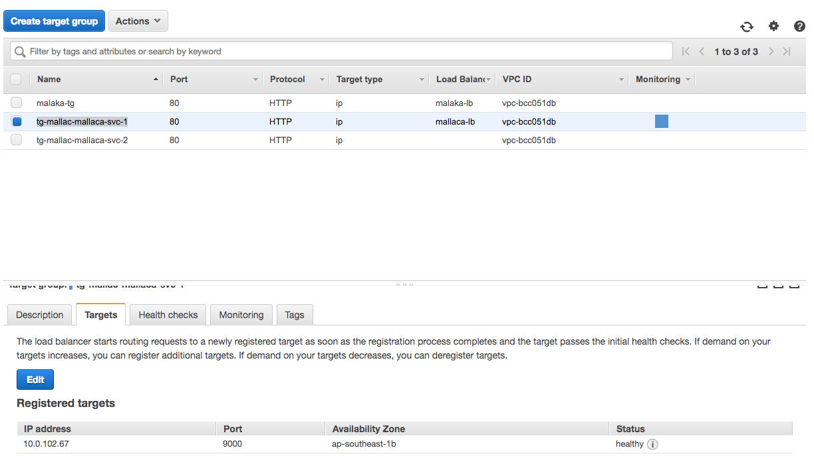

= Release and Deployment Digital Billing System

== Release 

=== Production Release Step

*Do :*

. Each SE (Software Engineer) should create Pull Request to to `pre-release` branch AFTER THE TASK IS ACCEPTED BY QA.
. A.S.A.P for no.1
. Release Person, must build and create a release notes for each task ready for release.
 .. At minimal a full day before release schedule, release must be done
 .. Check all PR
 .. Merge PR task one-by-one to `pre-release`
 .. If there's conflict : resolve it.
If you're not sure, coordinate with SE who work for those task.
 .. After all successfully merged into `pre-release` : Create RELEASE DRAFT on github.
Mark a tag for version number : 1.x.x ( major, medium, single-task )
 .. Finalize release from step 5
 .. Do PR from `pre-release` to `master` branch
 .. WARNING : ALL PR MERGED INTO MASTER WILL BE RELEASED TO PRODUCTION (except for some repo, i.e : Terra)

*Don't :*

. Did not create Pull Request after task accepted by QA.
. Do not merge PR to `pre-release` without confirmation to person who create release.
. Unprotected branch `master` and `pre-release`.

=== Production Release Step (Terra)

*Do :*

. Each SE (Software Engineer) should create Pull Request to `UI*` branch ( i.e : piggybank-ui, meowth-ui ) AFTER THE TASK IS ACCEPTED BY QA.
. A.S.A.P for no.1
. Release Person, must build and create a release notes for each task ready for release.
. Merge one-by-one into `UI*` branch
. Merge each `UI*` branch with latest origin/`master`
. Create PR from `UI*` branch to `master` and put a clear release note in every PR
. Coordinate with Bayu (Data Team), or other person who can handle deployment with Terra

=== Development and UAT Release

*Do :*

. All step are equal for previouse release guide
. Except:
 .. Did not need to create Tag release
 .. Merge into `development` branch to deploy into development server
 .. Merge into `pre-release` branch to deploy into UAT/Staging server

== Deployment

===  _Deployment Schedule_

Jadwal _deployment_ disbursement bersifat tentatif.

Idealnya, deployment dieksekusi *sebelum _sprint review_* dilakukan.
Jika tidak bisa dieksekusi pada waktu tersebut, proses deployment bisa dilakukan sepanjang _sprint_ atau setelahnya.

=== _Production: Blue Green Deployment_

Karena target di awal adalah pengembangan di atas _ECS Fargate_, kita akan memaksimalkan penggunaan _autoscale feature_ dan konsep _blue-green deployment_.

_Blue-Green_ dapat juga disebut _Black-Red atau A-B *deployment_.
Pada dasarnya, cara kerja _Blue-Green Deployment_ adalah dengan mengganti _traffic_ dari versi awal _(blue)_ ke versi terbaru _(green)_.
Hal yang diamati adalah versi _green_, jika OK maka versi _green_ akan diterima sebagai proses _production_.

Untuk penjelasan yang lebih detail, dapat dilihat pada https://aws.amazon.com/blogs/devops/use-aws-codedeploy-to-implement-blue-green-deployments-for-aws-fargate-and-amazon-ecs/[link berikut].

=== Pre-Requisite

_Developer_ dapat berkonsultasi dengan team Infra untuk kebutuhan berikut:

. _Security Group_
. _Load Balancer_
. _Target Groups_
. _Amazon ECS_

=== Security Group

_Disburse container_ secara _default_ menggunakan _port_ 9000 sebagai _inbound traffic_, sehingga harus dilakukan pengaturan pada _Security Group_.
Sebaiknya semua _port available_ untuk _outbound_.
Saat ini, _disbursement_ menggunakan _Mallac-3280_ sebagai _Security Group_.

=== Load Balancer

_Developer_ harus berkonsultasi dengan infra team terkait hal ini.

_Load balancer_ dibutuhkan untuk mengganti _traffic_ antara versi _Blue_ dan _Green_ pada aplikasi.

Jika _developer_ ingin menggunakan _SSL_ atau _domain_, pengaturan dapat dilakukan dengan catatan sebagai berikut:

. *_Only create listener Port 80 manually_* _and give a redirect rule to 443_.
. *_No need to add listener manually_* _since it will be created by ECS Service when you successfully create it_.
. _By default disburse need three listeners, as shown below_.
+

. *_After successful creation of a service_*, _please modify listener port 443 to use SSL Certificate_.
. *_Forwarding rules will be switched automatically_* _when the deployment is on process_.

=== _Target Groups_

_Developer_ tidak perlu membuat target _group_ secara manual, karena akan dibuat secara otomatis ketika membuat _service_ pada _ECS Cluster_ dan akan ditangani oleh _CodeDeploy_.

Secara _default_, `tg-mallac-mallaca-svc` akan digunakan sebagai _Blue_ target, namun akan secara bertahap berganti menjadi `tg-mallac-svc-2` setelah _deployment_ selanjutnya sukses dilaksanakan.

*Notes :*

*Jangan membuat target secara manual.*

_Health check threshold_, _timeout_, dan kebutuhan _interval_ harus dikonfigurasi ulang karena _service build time_ untuk _disbursement-server container_ akan membutuhkan sekitar 4-5 menit hingga siap untuk semua _request server_.

Berikut adalah pengaturan yang harus diterapkan pada _Health Checks Target Group_ 1 dan _Target Group_ 2:

|===
| *Rule* | *Value*

| _Protocol_
| HTTP

| _Path_
| /stats

| _Healthy Threshold_
| 5

| _Unhealthy Threshold_
| 5

| _Timeout_
| 120

| _Interval_	125
|

| _Success Code_
| 204
|===

=== _Amazon ECS_

_This the main stack for the disbursement server.
We will need:_

|===
| *Component* | *Description*

| _Cluster_
| _An Amazon ECS cluster is a regional grouping of one or more container instances on which you can run task requests.
Each account receives a default cluster the first time you use the Amazon ECS service.
Clusters may contain more than one Amazon EC2 instance type_.
https://docs.aws.amazon.com/AmazonECS/latest/developerguide/clusters.html[_Learn More_].

| _Services_
| _A service lets you specify how many copies of your task definition to run and maintain in a cluster.
You can optionally use an Elastic Load Balancing load balancer to distribute incoming traffic to containers in your service.
Amazon ECS maintains that number of tasks and coordinates task scheduling with the load balancer.
You can also optionally use Service Auto Scaling to adjust the number of tasks in your service_.

| _Task Definitions_
| _Task definitions specify the container information for your application, such as how many containers are part of your task, what resources they will use, how they are linked together, and which host ports they will use_.
https://docs.aws.amazon.com/AmazonECS/latest/developerguide/task_definitions.html[_Learn More_].

| _Amazon ECR_
| _This our docker images registry_.
|===
