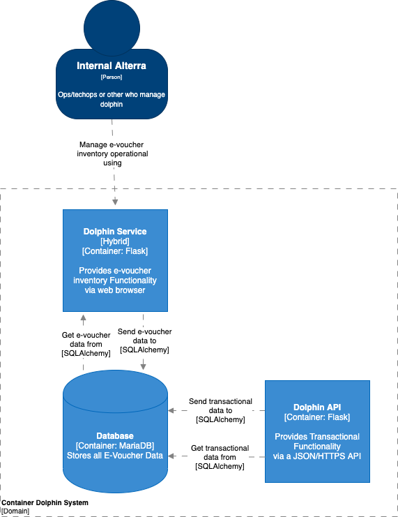

= Architecture Dolphin

== High Level Architecture

Berikut adalah gambar diagram C2 sistem Dolphin:

Sistem ini merupakan bagian dari BPA. Untuk lebih detail terkait hubungan Dolphin dengan sistem BPA lainnya, silakan mengakses <<../../../../../Divisions/Meet-Our-Divisions/Technology/Engineering/Alterra-Systems-C1-Diagram/BPA-C1-Diagram.adoc#,BPA C1 Diagram>> berikut.

== Related Systems

[cols="10%,20%,35%,35%",frame=all, grid=all]
|===
^.^h| *System Name*
^.^h| *Description*
^.^h| *Depends on*
^.^h| *Be a Dependencies to*

|Dolphin
|Voucher inventory system
a|-
a| 1. Dolphin - *As Voucher Inventory*
|===