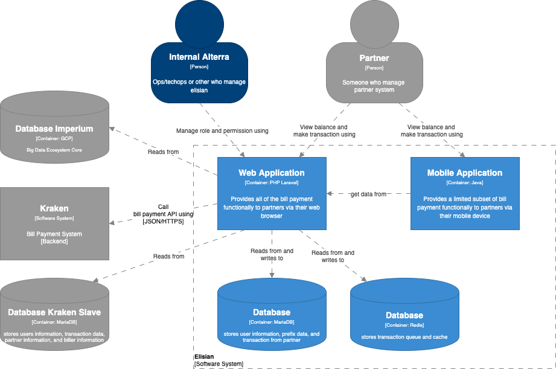

= Architecture Elisian

== High Level Architecture

Berikut adalah gambar diagram C2 sistem Elisian:

Sistem ini merupakan bagian dari BPA. Untuk lebih detail terkait hubungan Elisian dengan sistem BPA lainnya, silakan mengakses <<../../../../../Divisions/Meet-Our-Divisions/Technology/Engineering/Alterra-Systems-C1-Diagram/BPA-C1-Diagram.adoc#,BPA C1 Diagram>> berikut.

== Related Systems

[cols="10%,30%,30%,30%",frame=all, grid=all]
|===
^.^h| *System Name* 
^.^h| *Description* 
^.^h| *Depends on* 
^.^h| *Be a Dependencies to*

|Elisian
a|1. Partner Dasboard: Dashboard for Ops, Onboarding, Pricing, Legal, Partner transaction.
2. Elisian Landing Page: Registration page for Partner.
a|1. link:../Kraken/index.adoc[Kraken] - *As BE API*
2. link:../Imperium/index,adoc[Imperium] - *As Big Data Provider*
| -
|===