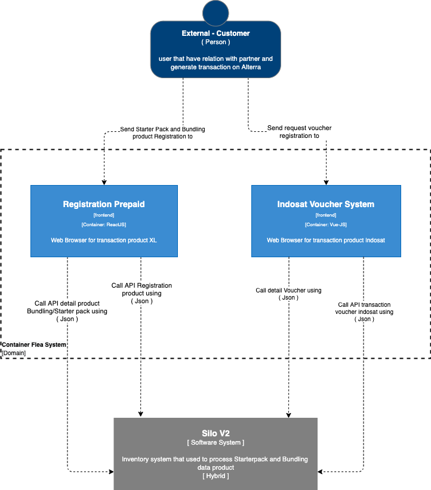

= Architecture Flea

== High Level Architecture

Berikut adalah gambar diagram C2 sistem Flea:

Sistem ini merupakan bagian dari Telco. Untuk lebih detail terkait hubungan Flea dengan sistem Telco lainnya, silakan mengakses <<../../../../../Divisions/Meet-Our-Divisions/Technology/Engineering/Alterra-Systems-C1-Diagram/Telco-C1-Diagram.adoc#,Telco C1 Diagram>> berikut.

== Related Systems

|===

| *System Name* | *Description* | *Depends on* | *Be a Dependencies to*

|Flea
|Dashboard System for SIMCard Registration
a|1. Silo - As BE API
|-

|===
