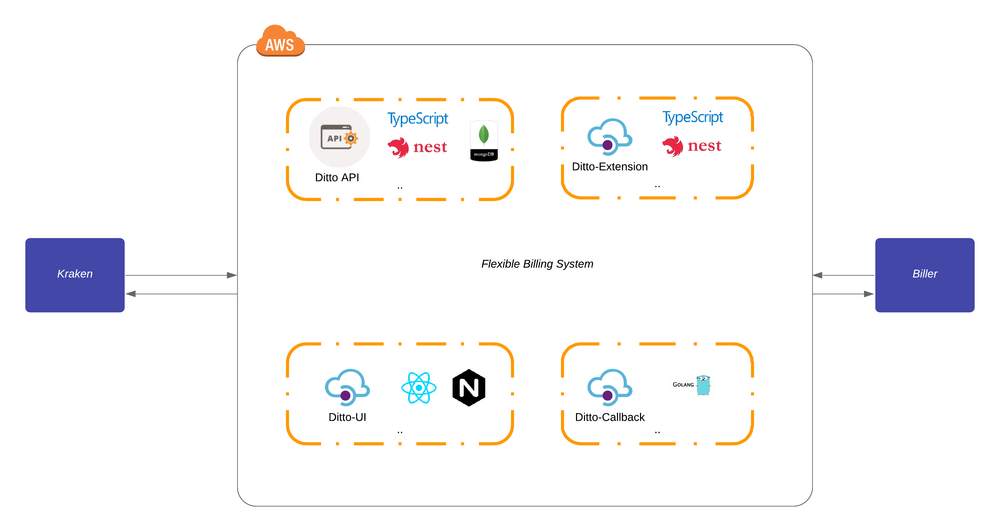

= Architecture Flexible Billing System

== High Level Architecture

Berikut adalah gambar _High Level Architecture_ (HLA) sistem Flexible Billing System:

== Related System

|===
| *System Name* | *Description*

| Kraken
| _Microservice_ yang pertama kali dibuat Sepulsa

| Biller Sentinel
| _User Interface_ berupa _Web Dashboard_ yang terhubung dengan beberapa sistem
|===
