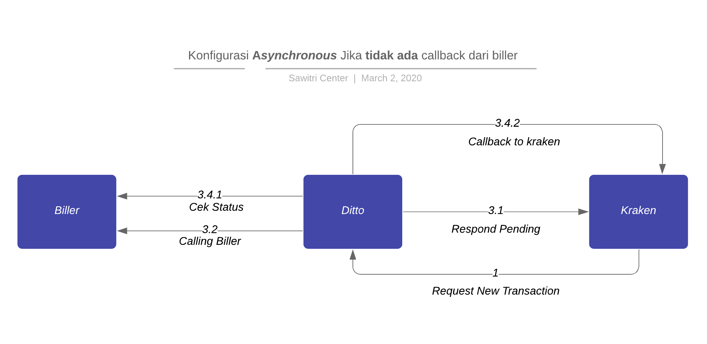
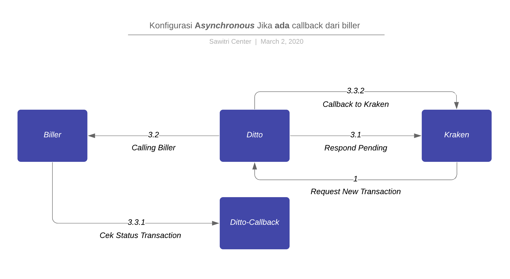
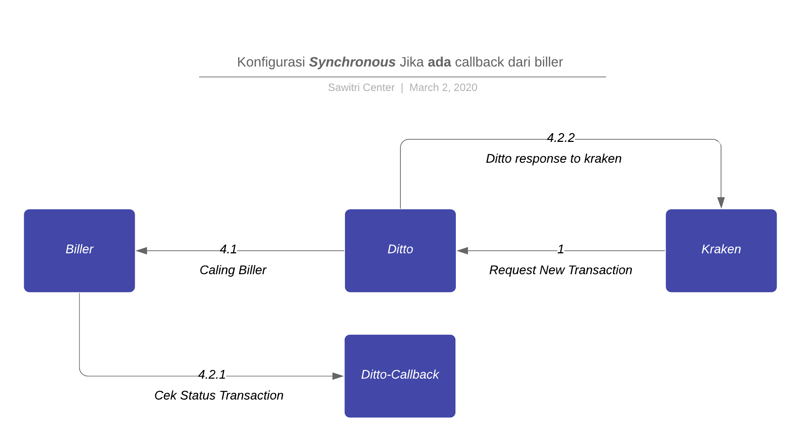
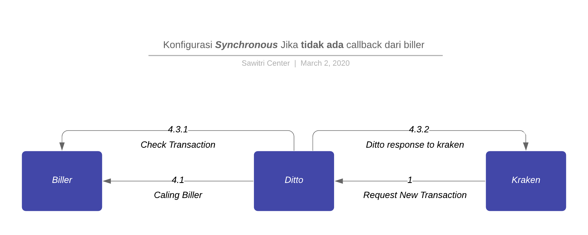

= Developer Onboarding Flexible Billing System

Berikut adalah gambar diagram _flow develop onboarding asynchronous_ jika ada _callback_ dari Biller:

Berikut adalah gambar diagram _flow develop onboarding asynchronous_ jika tidak ada _callback_ dari Biller:

Berikut adalah gambar _diagram flow develop onboarding synchronous_ jika ada _callback_ dari Biller:

Berikut adalah gambar diagram _flow develop onboarding synchronous_ Jika tidak ada _callback_ dari Biller:

== Local Machine Setup

Untuk melakukan instalasi di lokal, berikut adalah langkah-langkah yang harus diikuti. Konfigurasi _onboarding_ melalui ditto-ui yang akan diarahkan ke Ditto.

. Kraken men-_trigger_ bila ada transaksi Biller ke Ditto (Kraken > Ditto)
. Konfigurasi  *Asynchronous*

.. Ditto merespon status _pending_ ke Kraken

.. Ditto melakukan panggilan ke Biller

.. Jika ada _callback_ dari Biller

... Biller melakukan *update* status transaksi ke Ditto-Callback

... Ditto melakukan *callback* ke Kraken

.. Jika tidak ada _callback_ dari Biller

... Ditto akan melakukan pengecekan status transaksi secara berkala ke Biller sesuai pengaturan *onboarding*

... Setelah mendapatkan status terbaru, Ditto melakukan *callback* ke Kraken

. Konfigurasi *Synchronous*

.. Ditto melakukan panggilan ke Biller

.. Jika ada _callback_ dari Biller

... Biller melakukan *update* status transaksi ke ditto-callback

... Ditto melakukan *callback* ke Kraken

.. Jika tidak ada _callback_ dari Biller
... Ditto akan melakukan pengecekan status transaksi secara berkala ke Biller sesuai pengaturan *onboarding*

... Setelah mendapatkan status terbaru, Ditto melakukan *callback* ke Kraken.
