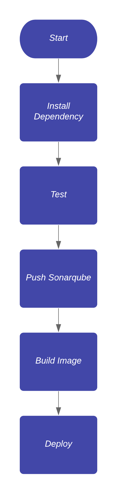

= Release and Deployment Flexible Billing System

Proses Deployment menggunakan teknik CI/CD dengan bantuan kubernetes kubectl. Berikut tahap tahap _deployment_ _Flexible Billing System :

. Install dependency
. Test
. Push sonarqube
. build_image (untuk diupdate ke server)
. deploy (di deploy ke server yang ada di kubernetes pakai kubectl)

Gambar Flow Diagram Proses Deployment :

