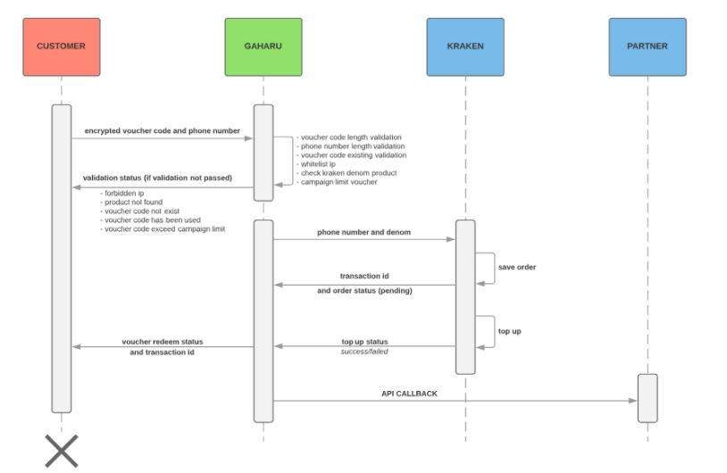

= API Documentation Callback Gaharu

Berikut adalah Flow API callback pada sistem Gaharu:

== API Callback Public

|===
| *Name* | *Spesification*

| URL
| URL Partner

| Method
| POST

| Headers
a| * Key
* Value  
* Content-Type
* application/json

| Example Request (raw: json)
a| 
[source]
O3PnjeUy2MiPB5JXPK+19ajE5HPmpWHGhRR6NpYjs2E1egT2wjzfQ8D4pmK08YkFLj9yTCZ1uO12DBByJpb6Q  { "data": {  "message":"success","order_id":"GF1749819-1783659", "serial_number":"170845202007277930990000020000}}`

| Example decrypt function
a| 
[source]
function gaharu_decrypt($str, $key) {$str = base64_decode($str); $str = mcrypt_decrypt(MCRYPT_RIJNDAEL_128, $key, $str, MCRYPT_MODE_ECB); $block = mcrypt_get_block_size('rijndael_128', 'ecb'); $pad = ord($str[($len = strlen($str)) - 1]); $len = strlen($str);
$pad = ord($str[$len - 1]); return substr($str, 0, strlen($str) - $pad);}`

| Description
a| Top Up Status 

1. true        : voucher success redeem 
2. false       : voucher failed redeem 

| How to decrypt
| Make a new function for Decrypt Payload (Example Decrypt Function)
|===
