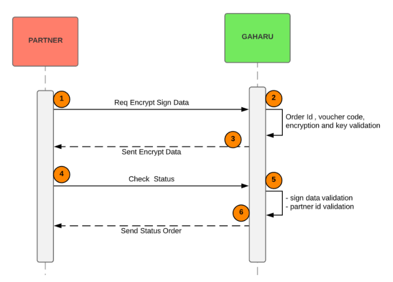

= API Documentation Check Status Gaharu

API for check status is made by Alterra for partner, which can make it easier for partners to check transactions automatically in Gaharu.

. *Request Sign Data* : partner request sign data, which is used to check order status
. *Validation* : Gaharu validates parameters order id, voucher order, encryption and key
. *Send Encrypt Data* : Gaharu sends encrypt sign data to partners
. *Check Status* : Partner checks the status using the sign data that has been obtained
. *Validation* : Gaharu validates parameters sign data and partner id
. *Send Order Status* : Gaharu send the order status to partner

== List API Check Status Gaharu

=== 1. Sign Data

API Encrypt Sign Data is to get the sign data for used to get the data key sign needed to check the status order

|===
| *Name* | *Spesification* 

| Encryption Function Code (PHP)
a| 
[source,php]
function _phpaes_encrypt($str, $key) { + $block = mcrypt_get_block_size('rijndael_128', 'ecb'); $pad = $block - (strlen($str) % $block); $str .= str_repeat(chr($pad), $pad);return
base64_encode(mcrypt_encrypt(MCRYPT_RIJNDAEL_128, $key, $str, MCRYPT_MODE_ECB));} $voucher_code = "JtLylg";
$order_id = "GF5022-49032";
$str = '{"voucher_code":"' . $voucher_code . '","order_id":"' . $order_id . '"}';
$key = "abcdefghijklmnopqrstuvwxyz1234567890";
$sign_data = _phpaes_encrypt($str, $key);

| validation
| Voucher code or order id not null

|===

=== 2. API Check Status

API check status to get data from order, to check the status, you need key sign data

|===
| *Name* | *Spesification* 

| URL
a| 
[source]
\{server_host}/api/v1/voucher/check_status + {\{server_host}}

`{\{server_host}}` can be:

1. http://localhost:8080/ - Local Environment  
2. https://gaharu-uat.sepulsa.id/ - Staging/UAT Environment 
3. TBA - Production Environment

| Method
| POST

| Headers
a| * Key
 * Value
 * Content-Type
 * application/json

| Parameter Description
a| Description :  

1. sign_data : key sign data to get status order  

2. Partner_id : partner id from gaharu

| Example Request
a| 
[source]
{"sign_data": "Wo0NPKcW6C5j0Z3D4o1OmSfrIlUzvOLjYfc4tY/lLHgJmMUiTyMNQdcLEcHVnLtz", "partner_id": "5022"}

| Example Response
a| 
[source]
{ "data": { "admin_charge": 0,"trx_id": "", "datetime": "20191223112600","terminal_id": "PLK11K3", "material_number": "01428800700","subscriber_id": "547104409005","pln_refno": "0MSP23201601041158003e5000000014", "switcher_refno": "0MSP23201601041158003e5000000014",  "subscriber_name":"SEPULSAWATI\b","subscriber_segmentation": "R1", "power": 1300, "distribution_code": "54","service_unit": "54720", "service_unit_phone": "123","max_kwh": "00936","meterai": "0.00","ppn": "510.00", "ppj": "499.00", "angsuran": "0.00","power_purchase": "484.00","jml_kwh": "40.00", "token": "98797784514987654323","info_text": "Informasi Hubungi Call Center 123
Atau hubungi PLN Terdekat",  "total_repeat": "0", "merchant_code": "6021","bank_code": "6003110", "stan": "20191223112600", "vending_refno": "00000000", "amount": "200000", "settlement": "","produk": "PLNPREPAID","rc": "0000", "meter_number": "01428800700","status": 1, "order_id": "1577075244-GF5022-49016"}}
|===
