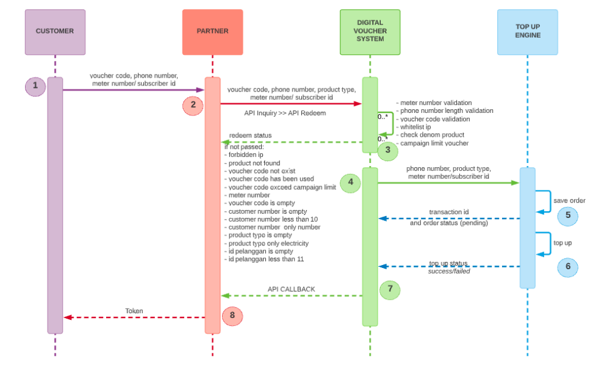
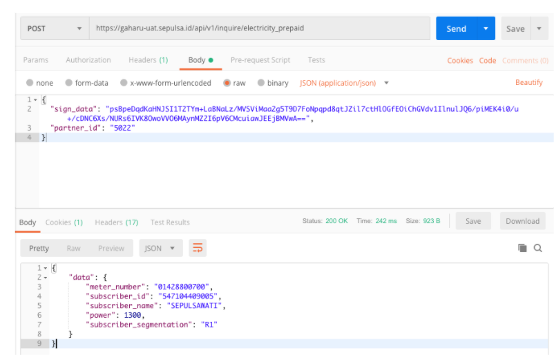
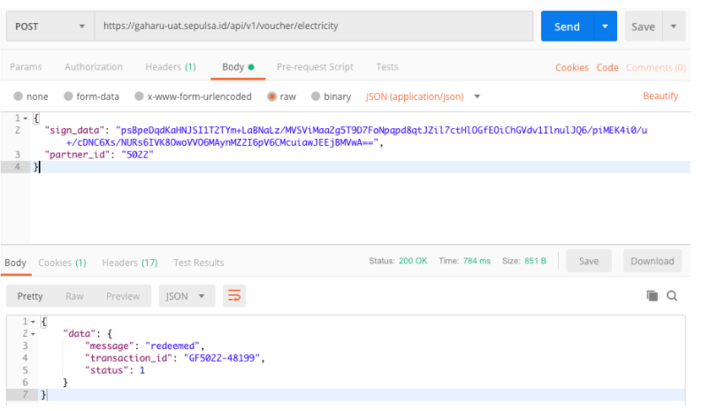

= API Documentation PLN Prepaid Gaharu 

== API Gaharu PLN Prepaid

Digital voucher system for supporting program to create real value of Electricity (PLN) products by deeply engaging with customer and offer unique proposition that no one has to offer.

=== Flow redeem and inquiry via digital voucher system

== List API PLN Prepaid Gaharu 

=== 1. Sign-data Encryption

|===
| *Name* | *Spesification*

| Encryption Function Code (PHP)
a| 
[source]
function _phpaes_encrypt($str, $key) {$block = mcrypt_get_block_size('rijndael_128', 'ecb');$pad = $block - (strlen($str) % $block);$str .= str_repeat(chr($pad), $pad); return base64_encode(mcrypt_encrypt(MCRYPT_RIJNDAEL_128, $key, $str, MCRYPT_MODE_ECB));}

| Argument Explanation
a| 
[source]
$str : string contain voucher_code, customer_number, product_type and id_pelanggan $key : secret key string Example + $voucher_code = "rmv0sQ";
$customer_number = "0812345000001";
$product_type = "electricity";
$id_pelanggan = "01428800700";
$str =  '{"voucher":"' . $voucher_code . '","customer_number":"' . $customer_number . '","product_type":"' . $product_type . '","id_pelanggan":"' . $id_pelanggan .'"}'; $key = "`abcdefghijklmnopqrstuvwxyz1234567890`"; $sign_data = _phpaes_encrypt($str, $key);

| Validation
a| 1. Voucher_code : not null 
2. Customer_number : null/not less than 10 digit 
3. Product_type : must filled with '`electricity`' 
4. Id_pelanggan (meter number/subscriber id) : Not less than 11 digit
|===

=== 2.API Inquiry PLN Prepaid

|===
| *Name* | *Spesification*

| URL
a| 
[source]
\{server_host}api/v1/inquire/electricity_prepaid + {\{server_host}} 

`{\{server_host}}` can be:

1. http://localhost:8080/ - Local Environment 
2. https://gaharu-uat.sepulsa.id/ -Staging/UAT Environment 
3. TBA - Production Environment

| Method
| POST

| Headers
a| * Key 
* Value 
* Content-Type 
* application/json

| Parameter description
a| Description : 

1. sign_data        : use return data from encryption function above 
2. partner_id       : partner_id from sepulsa

| Example Request
a| 
[source]
{ "sign_data": "psBpeDqdKaHNJSI1T2TYm+LaBNaLz/MVSViMaa2g5T9D7FoNpqpd8qtJZil7ctHlOGfEOiChGVdv1IlnulJQ6/piMEK4i0/u+/cDNC6Xs NURs6IVK8OwoVVO6MAynMZ2I6pV6CMcuiawJEEjBMVwA=="  "partner_id": "5022" }

| Example Response
a| 
[source]
{"data": {  "meter_number": "01428800700", "subscriber_id": "547104409005","subscriber_name": "SEPULSAWATI","power": "1300" "subscriber_segmentation": "R1"}
|===

=== 3.API Redeem PLN Prepaid

|===
| *Name* | *Spesification*

| URL
a| 
[source]
\{server_host}api/v1/voucher/electricity + {\{server_host}} 

`{\{server_host}}` can be: 

1. http://localhost:8080/ - Local Environment  
2. https://gaharu-uat.sepulsa.id/ - Staging/UAT Environment 
3. TBA - Production Environment

| Method
| POST

| Headers
a| * Key 
* Value
* Content-Type 
* application/json

| Parameter description
a| Description :

1. sign_data        : use return data from encryption function above 
2. partner_id       : partner_id from sepulsa

| Example Request
a| 
[source]
{ + "sign_data": "psBpeDqdKaHNJSI1T2TYm+LaBNaLz/MVSViMaa2g5T9D7FoNpqpd8qtJZil7ctHlOGfEOiChGVdv1IlnulJQ6/piMEK4i0/u+/cDNC6Xs/NURs6IVK8OwoVVO6MAynMZ2I6pV6CMcuiawJEEjBMVwA==","partner_id": "5022" + }

| Example Response
a| 
[source]
{"data": { "message": "redeemed",  "transaction_id": "GF5022-48199", "status": 1} }`
|===

== 4.API Callback PLN Prepaid

|===
| *Name* | *Spesification*

| URL
| URL Partner

| Method
| POST

| Headers
| *Key* , *Value* + *Content-Type*, *application/json*

| Example Request (raw: json)
a| 
[source]
{ "data": { "admin_charge": 3000, "trx_id": "", "datetime": "20190920180053", "terminal_id": "1391013909607231",  "material_number": "01428800700",  "subscriber_id": "547104409005",  "pln_refno": "85C4E82B554577391B5AB8E2DF56C45D", "switcher_refno": "044112CA42F4E62E1D4232D52343426B","subscriber_name": "SEPULSAWATI", "subscriber_segmentation": "R1","power": 1300, "distribution_code": "02","service_unit": "00005","service_unit_phone": "000000000000015","max_kwh": "00005","meterai": "0.00", "ppn": "510.20", "ppj": "499.90", "angsuran": "494.85","power_purchase": "48495.05","jml_kwh": "40.52","token": "98797784514987654323", "info_text": "RINCIAN TAGIHAN DAPAT DIAKSES DI "www.pln.co.id" ATAU PLN TERDEKAT", "total_repeat": "0", "merchant_code": "6012", "bank_code": "4410010","stan": "253780087118","vending_refno": "","amount": "20000", "settlement": "20190920","produk": "PLNPREPAID","rc": "0000","meter_number": "01428800700", "topup_status": "1/0",   ---------     (1=success   0=failed) "order_id": "GF420-48261"} }

| Partner need to do
| Make a new endpoint to receive our data from API Callback
|===
