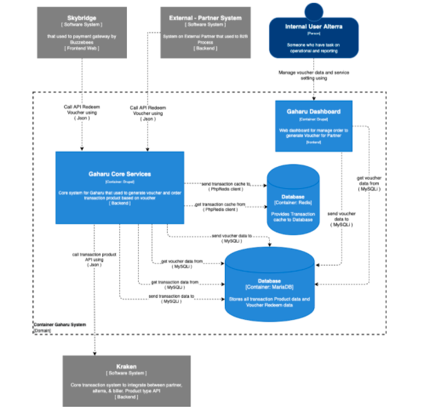

= Architecture Gaharu

== High Level Architecture

Berikut ini adalah diagram C2 sistem Gaharu : 

Sistem ini merupakan bagian dari Telco. Untuk lebih detail terkait hubungan Gaharu dengan sistem Telco lainnya, silakan mengakses <<../../../../../Divisions/Meet-Our-Divisions/Technology/Engineering/Alterra-Systems-C1-Diagram/Telco-C1-Diagram.adoc#,Telco C1 Diagram>> berikut. 

== Related System

Berikut adalah daftar sistem yang berhubungan dengan sistem Gaharu:

|===
| *System Name* | *Description* | *Depends on* | *Be a Dependencies to*

|Gaharu
|Digital Voucher System Platform
a| . link:../Kraken/index.adoc[Kraken] - As Bill Payment Aggregator 
a| . Skybridge - As Digital Voucher Provider
. Partner (External) - As Digital Voucher Provider|
|===