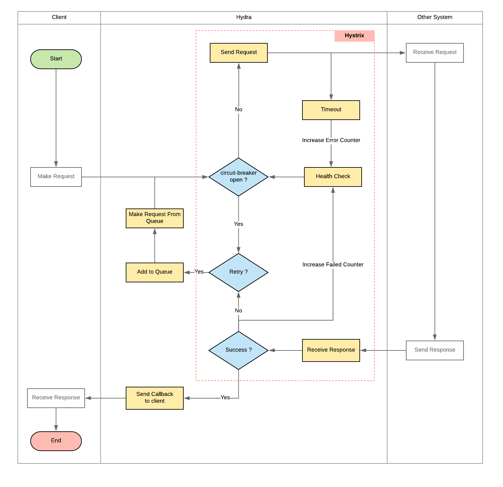

= Hystrix and Hystrix-Go Hydra

== Implementasi Hystrix-go pada Hydra

Hystrix digunakan sebagai _wrapper_ untuk fungsi apapun. Dalam Hydra, _package_ ini digunakan untuk _wrapping http call_.  _Package_ ini juga menggunakan Hystrix-Go yang akan dipanggil dalam _Heimdall Package_. Kita menggunakan _Heimdall Package http call and retriever_ sehingga _development_ berjalan lebih singkat. Berikut merupakan gambaran flowchart Hydra:

