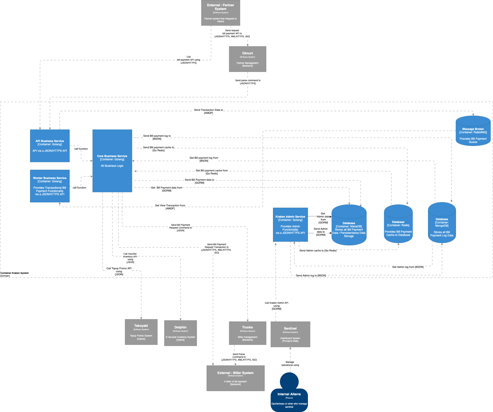
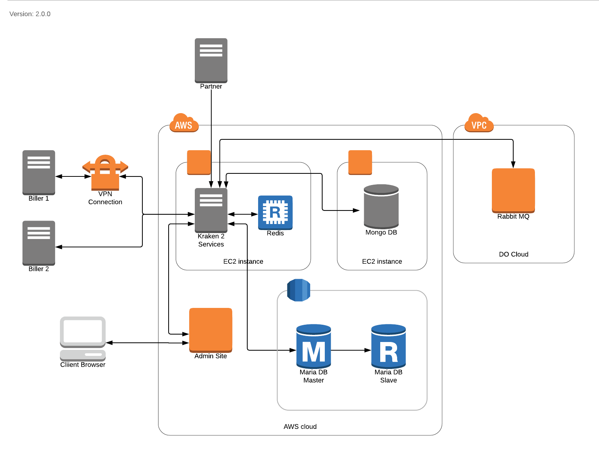
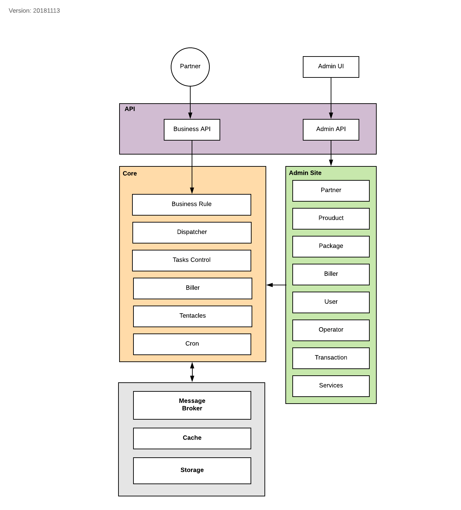

= Architecture Kraken

== High Level Architecture

Berikut adalah gambar diagram C2 sistem Kraken V2:

Sistem ini merupakan bagian dari BPA. Untuk lebih detail terkait hubungan Kraken V2 dengan sistem BPA lainnya, silakan mengakses <<../../../../../../../Divisions/Meet-Our-Divisions/Technology/Engineering/Alterra-Systems-C1-Diagram/BPA-C1-Diagram.adoc#,BPA C1 Diagram>> berikut.

== Related Systems

[cols="10%,30%,30%,30%",frame=all, grid=all]
|===
^.^h| *System Name* 
^.^h| *Description* 
^.^h| *Depends on* 
^.^h| *Be a Dependencies to*

|Kraken V2
|Bill Payment System. Core transaction system to integrate between partner, alterra, & biller. Product type API
|
|-
|===

== Physical Diagram

Lucidchart Link: https://www.lucidchart.com/documents/edit/c3756f20-7010-4849-aaaf-d78b2e9813fe[]

== Logical Diagram

Lucidchart link: https://www.lucidchart.com/documents/edit/ab261b06-1a92-4f83-a12b-acb8091f2171[]

Terdapat 2 (dua) fungsi utama yang ada di Kraken 2, yaitu *admin*, *site*, *management*, dan *layanan transaksi*.

Berdasarkan dua (2) fungsi di atas terdapat 2 jenis API, yaitu:

1.  *Admin API* Admin API adalah API yang digunakan untuk mengelola data Kraken, dimana API ini khusus digunakan oleh _admin site_ Kraken. Data Kraken, di antaranya: _partner_, _biller_, _product_, _package_, _user_, _operator_, _services_, _transaction_.
2.  *Business API* Business API digunakan oleh Partner untuk melakukan proses _inquiry_ dan transaksi pembayaran.
