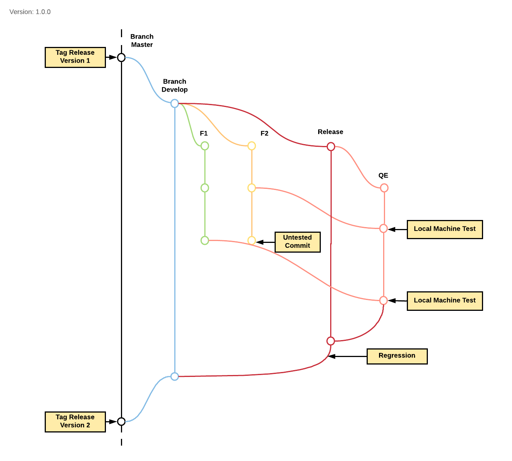

= Gitflow Kraken V2

1. _Branch_ *Master* hanya digunakan untuk kode produksi akhir dan untuk melakukan _hot-fix_
2. Saat *_start_* sebuah _task_ di Pivotal Tracker, pastikan untuk membuat _branch_ baru dari _branch_ *develop*, dengan format: `feature/[pivotal_id]-[pivotal-story-title]`
3. Untuk setiap rilis baru akan memiliki _branch_ sendiri, idealnya ini akan dibuat setelah setiap rilis dilakukan
4. Buat new pull request ke _branch_ *QE* setelah menyelsaikan _task_ Anda, _code_ Anda akan ditinjau oleh Kraken SE Lead sebelum digabung.
5. Semua Pengujian pada fitur dan perbaikan bug akan dilakukan pada _branch_ QE, untuk diterima atau ditolak kemudian
6. Setelah melewati semua tes, _branch_ QE akan di-_merge_ ke _release branch_.
7. _Regression test_ dijalankan pada _release branch_ sebelum di-_merge ke _branch develop_, kemudian ke _branch master_.
