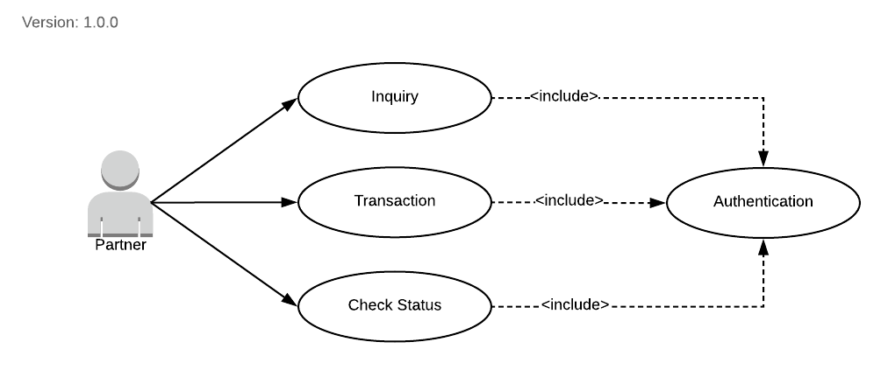
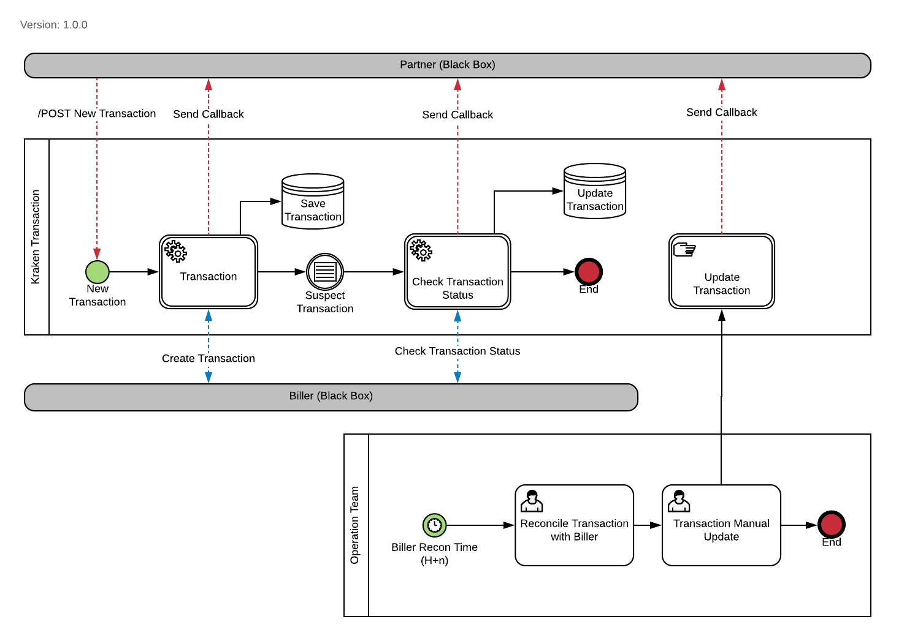

= Transaction Kraken V2

== Primary Actor

____
Partner
____

== Main Success Scenario

1. Partner membuat transaksi
2. Kraken membuat transaksi di Biller
3. Biller mengirim _transaction response_ ke Kraken
4. Kraken mengenali transaksi sebagai _suspected transaction_
5. Kraken memeriksa _suspected transaction status_ ke Biller
6. Biller mengirim _update_ di _kraken transaction status_
7. Kraken mengirim Biller _response_ ke Partner

== Extensions

1. Partner tidak bisa melakukan transaksi
+
* _Partner credential_ tidak valid
* _Partner_ tidak terdaftar di Kraken Sistem
2.  Kraken Product/Package tidak tersedia
3.  Biller Transaction Gagal.
+
* Biller tidak bisa dijangkau 
* Biller tidak mengirim respons transaksi ke Kraken
* Masalah di pihak Operator 
* Kraken Deposit di Biller tidak cukup

4. Partner tidak menerima _callback_ 
+
* Partner _called timeout_ 
* Partner melakukan pengecekan status transaksi 
* Transaksi secara harfiah dalam status _pending_, perlu direkonsiliasi secara manual

== Output

**Usecase Kraken V2**

**Diagram**

**BPMN Kraken V2**

Kraken V2 Business Process Notation

