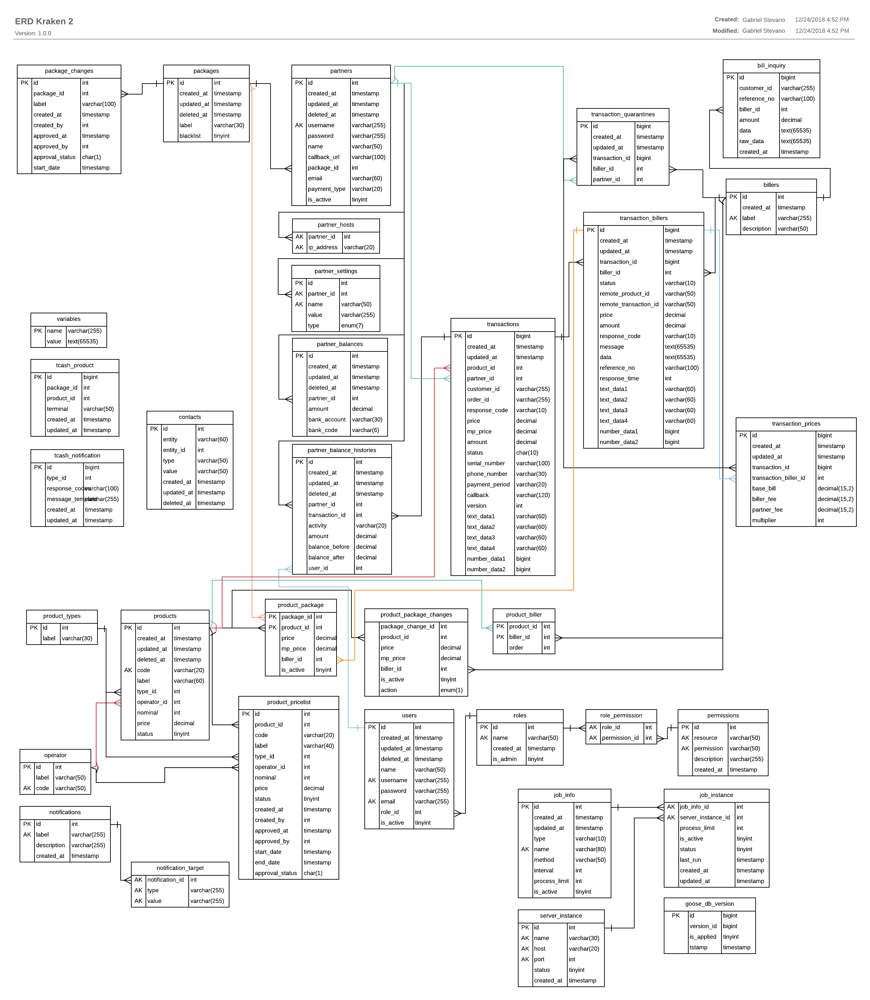

= Database Documentation Kraken V2

== Entity Relationship Diagram

== Kraken V2 Database Table Description

[cols="30%,70%",frame=all, grid=all]
|===
^.^h|*Table Name* 
^.^h| *Description*

| package
| _Package's identity and information_

| package_changes
| _Package data change log/history_

| partners
| _Partner's identity and information_

| patner_host
| _Partner IP storage_

| partner_setting
| _All setting for each partner_

| partner_balances
| _Balancing about invoices, deposits each partner in_ Kraken

| partner_balance_histories
| _Detailing deposits partner from_ partner_balances

| transactions
| _Store transactions carried out by partners_

| transaction_quarantines
| _store pending transaction_

| transaction_prices
| Menyimpan detail harga transaksi yang dilakukan oleh _partner_

| transaction_billers
| _Biller transaction in_ Kraken _product package_

| billers
| _Biller's identity and information_

| bill_inquiry
| _All inquiry requests to the biller, before the transaction is made_

| product
| _Product will be selling_

| product_biller
| _product biller data used in_ Kraken

| product_types
| _Product will be sellin, examples: Voucher games,_ BPJS Kesehatan, _and etc_

| product_package
| _The package used by certain partners, in which there are any products and configurations_

| product_package_changes
| _changes for product package_

| product_pricelist
| _Pricelist product which want to selling_

| operator
| _Operator which applied to product_, _like_ XL, T-Sel, _and etc._

| notifications
| _Notification system_

| notification_target
| _Target system for notification_

| users
| _User which able to access system_

| roles
| _Users role used in_ Kraken

| roles_permission
| _Mapping roles and who can access system_

| permissions
| _Mapping roles_

| job_info
| _Information job in system_

| job_instance
| _Instance job in system_

| server_instance
| _Server Job table identity and information_

| goose_db_version
| Data dummy
|===